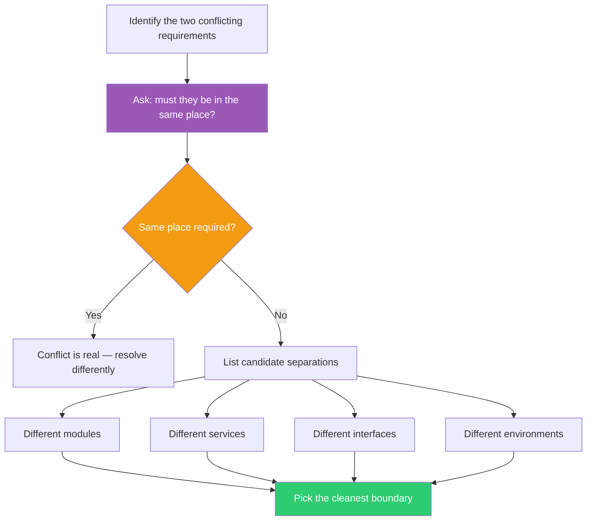

## The Move

You have two requirements that conflict when they live in the same place. Ask: do they actually need to be in the same place? Identify the two conflicting needs, then list the places they could live separately — different modules, different services, different interfaces, different environments, different data stores. For each candidate separation, check whether splitting removes the conflict without creating a worse coordination problem. Pick the split where the boundary is cleanest.

## When to Use

- Two features or requirements keep interfering with each other in the same component
- You're oscillating between two designs and neither fully works
- A module has grown tangled because it serves two masters
- You're hitting a tradeoff that feels fundamental but might just be a colocation problem

## Diagram

## Example

**Problem:** "Our API needs to be both fast for real-time reads and support complex analytical queries. Every optimization for one makes the other worse."

**The conflict:** Read latency vs. query flexibility, living in the same database and the same service.

**Separate in space:** Split into two data stores — a fast key-value store (Redis or DynamoDB) for real-time reads, and a columnar database (ClickHouse or BigQuery) for analytics. An event stream keeps them in sync. The API splits into two services: one optimized for low-latency lookups, one for complex queries with higher latency tolerance.

**Result:** Each service optimizes freely for its own requirement. The conflict disappears because the requirements no longer share a home. This is the CQRS pattern — and it's a spatial separation.

## Watch Out For

- Separation creates a coordination problem. Two places that must stay consistent are harder to manage than one place with a tradeoff. Make sure the coordination cost is lower than the conflict cost
- Don't separate prematurely. If the conflict is mild and the system is small, living with the tension may be cheaper than managing two things
- Sometimes the requirements conflict in time, not space — one is needed now, the other later. That's a different separation (TF-029 territory). Make sure you're solving the right dimension
- The cleanest boundary is one where the two sides rarely need to talk. If they need constant synchronization, you haven't actually separated — you've just added a network call
