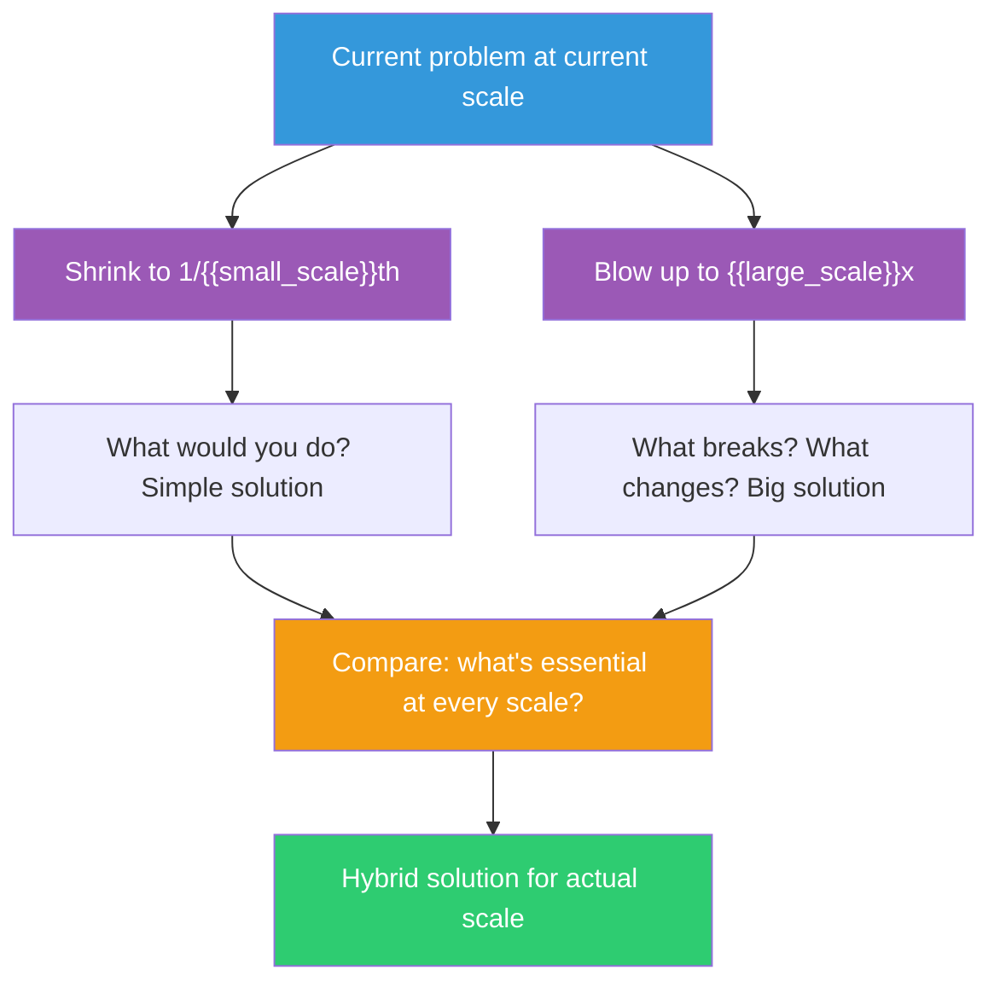

## The Move

Take your problem and run it through two scale experiments. First, shrink it: if this problem existed at 1/{{small_scale}}th the scale, what would you do? Write down that solution — it reveals what's essential vs. what's accidental complexity. Second, blow it up: at {{large_scale}}x the scale, what breaks? What would you be forced to do differently? Write down that solution — it reveals architectural truths you're currently ignoring. Now compare all three (tiny, current, huge). The solution for your actual scale usually borrows ideas from both extremes.

## When to Use

- You're stuck and want a new angle on the problem without changing the problem itself
- Your current solution feels either too simple or too complex for the actual situation
- You're debating whether to build for today's scale or tomorrow's
- The constraints at your current scale feel rigid — a scale shift might reveal they're not fundamental

## Diagram

## Example

**Problem:** "We have 500 microservices and debugging a production issue requires tracing requests across multiple services. We need an observability strategy."

**At 1/100th scale (5 services):** You'd just grep the logs. Maybe a shared log file. You'd know every service by name and who owns it. The "strategy" is: SSH in and read the logs. **Insight:** The core need is "follow a request from start to finish." Everything else is scale overhead.

**At 100x scale (50,000 services):** Grep is laughably insufficient. You'd need distributed tracing as infrastructure (Jaeger, Zipkin), automatic instrumentation, trace sampling, centralized log aggregation, service dependency maps generated from actual traffic, and anomaly detection because no human can monitor 50K services. **Insight:** At this scale, humans can't be in the loop for detection — only for diagnosis.

**Hybrid for 500 services:** Adopt distributed tracing (from the 100x solution — it's essential), but keep the UI simple and query-oriented like "follow this request" (from the 1/100th insight). Skip anomaly detection for now (that's a 100x need, not a 500 need). Add a service dependency map (useful at 500, essential at 50K, unnecessary at 5).

**What we learned:** The 1/100th scale told us what the core job is. The 100x scale told us what infrastructure is inevitable. The actual solution picks from both.

## Watch Out For

- The point isn't to build for 100x scale. It's to use 100x as a thought experiment that reveals which constraints are fundamental and which are artifacts of your current size
- At tiny scale, everything looks simple. Don't be seduced into thinking the tiny-scale solution works at your actual scale — extract the insight, not the implementation
- The most common mistake is over-indexing on the 100x solution and building premature infrastructure. The 1/100th solution is often closer to what you actually need right now
- Scale isn't just users or data. It can be team size, geographic distribution, number of features, or rate of change. Pick the dimension most relevant to your problem
