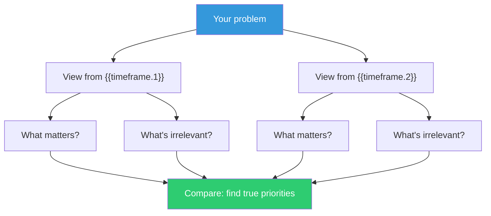

## The Move

Write down your problem in one sentence. Now evaluate it from two time horizons: **{{timeframe.1}}** and **{{timeframe.2}}**. For each, answer three questions: What matters most at this timescale? What's urgent now but irrelevant then? What seems optional now but becomes critical?

Compare your two lists. The items that appear important at both timescales are your real priorities. The items that only matter at one timescale reveal whether you're being reactive or strategic.

## When to Use

- You're drowning in urgent tasks and can't see the bigger picture
- A decision feels important but you can't articulate why
- You're debating short-term pragmatism vs. long-term investment
- Stakeholders disagree and they're actually arguing about different time horizons

## Diagram

## Example

**Problem:** "Should we rewrite our monolith into microservices?"

**From {{timeframe.1}} (say, 10 seconds):** Irrelevant. What matters at this scale is response time, latency, whether the page loads. The monolith is fine if it's fast.

**From {{timeframe.2}} (say, 5 years):** The question isn't monolith vs. microservices — it's "can we still ship features independently as the team grows from 12 to 60?" The architecture needs to support team autonomy, not just technical elegance.

**Comparison:** The short timescale reveals the rewrite has no user-facing urgency. The long timescale reveals the real driver is team scaling, not technology. This reframes the decision: don't rewrite for microservices, restructure for team independence — which might or might not mean microservices.

## Watch Out For

- Don't let the long-term view paralyze short-term action. Both timescales are real; neither is more "correct"
- If both timeframes produce the same answer, you don't have a time-horizon problem — you have a commitment problem
- This move clarifies priorities, not solutions. Follow up with a planning move to act on what you find
- Be honest about which timeframe you're emotionally drawn to — that's usually the one you should question
