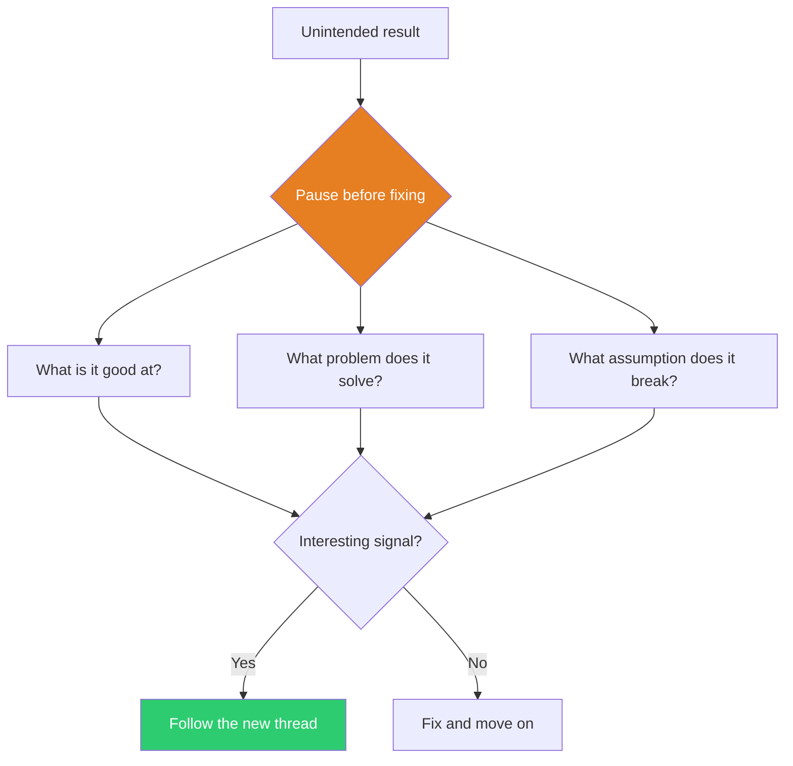

## The Move

You got an unintended result — a bug, a wrong output, a mistake. Before analyzing the error, hold this: **{{koan.1}}** Before you hit undo: stop. Describe exactly what happened, not what was supposed to happen. Now ask three questions: (1) What is this result actually good at? (2) What problem would this be the right answer to? (3) What assumption of mine does this error contradict?

Write down the answers. If any of them point somewhere interesting, follow that thread before reverting to the original plan.

## When to Use

- You produced an output that's "wrong" but strangely compelling
- A bug created behavior that users actually prefer
- Your prototype went sideways and you're about to throw it away
- You're stuck and the only new information you have is an error

## Diagram

## Example

**Situation:** A team building a music recommendation engine accidentally swapped the similarity metric — instead of recommending songs similar to what users listened to, it recommended songs similar to what users *skipped*. The recommendations were "wrong" by every metric.

**Honoring the error:** They noticed users were discovering more new artists through the broken recommendations. The "correct" algorithm was a filter bubble; the "broken" one was an exploration engine.

**Outcome:** They didn't ship the bug, but they extracted the insight: users need a mix of familiar and unfamiliar. They added an "adventure mode" toggle that deliberately loosened the similarity threshold — a feature that came directly from observing the error.

## Watch Out For

- Not every error is a hidden gem. Spend 2 minutes examining it; if there's no signal, fix it and move on
- This is not an excuse to avoid debugging. You're looking for insight, not rationalizing sloppiness
- The error is useful as *data*, not as a *solution*. Extract the insight, then decide deliberately whether to act on it
- If you find yourself "honoring" every error, you're procrastinating, not exploring
