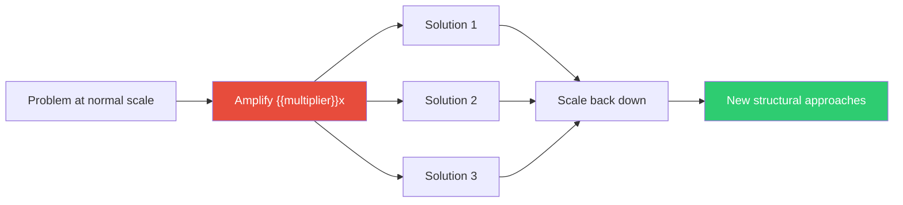

## The Move

Take your problem and amplify it by {{multiplier}}x. If latency is 200ms, make it 100 seconds. If you lose 2% of users at signup, make it 90%. If the bug happens once a week, make it happen every request. Now ask: how would you solve the exaggerated version? Write down three approaches.

Scale those solutions back to the original problem size. At least one of them will suggest an approach you hadn't considered at normal scale — because extreme problems bypass incrementalism and force structural thinking.

## When to Use

- The problem is real but feels too small to justify a major fix
- You're stuck in incremental-improvement mode and need a structural rethink
- The problem is hard to see because it's diffuse or intermittent
- Stakeholders won't prioritize it because it doesn't look bad enough

## Diagram

## Example

**Problem:** "Our CI pipeline takes 12 minutes, which is a bit slow."

**Exaggerated:** "Our CI pipeline takes 20 hours."

**Solutions for the extreme version:**
1. You'd never run the full suite locally — you'd run only affected tests and parallelize everything
2. You'd make the pipeline asynchronous — developers wouldn't wait for it; they'd get notified
3. You'd invest in caching every intermediate artifact aggressively because 20 hours of wasted compute is obviously insane

**Scaled back:** Solution 1 reveals that test selection and parallelization are worth doing even at 12 minutes. Solution 2 suggests making the pipeline non-blocking so developers don't context-switch while waiting. Solution 3 is already worth it — artifact caching is cheap and the team just hadn't prioritized it because "12 minutes isn't that bad."

The exaggeration made it obvious that the 12-minute pipeline was being tolerated, not solved.

## Watch Out For

- The point is structural insight, not panic. Don't use the exaggerated version to scare stakeholders — use it to think differently
- If the extreme version has the same solution as the normal version, the exaggeration wasn't useful. Try a different dimension to amplify
- Some problems don't scale linearly — 100x users isn't just "more users," it's a qualitatively different problem. That's a feature, not a bug
- Spend 5 minutes max. This is a quick reframing tool, not a scenario-planning exercise
