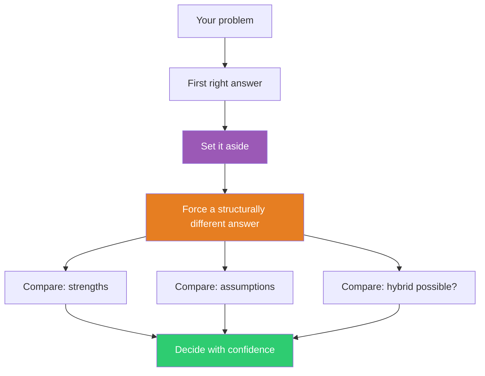

## The Move

Write down your current best solution in one sentence. Now explicitly set it aside: that answer is *off the table*. You cannot use it or any minor variation of it.

Generate a second solution that is structurally different — not a tweak, not a variation, but a fundamentally different approach to the same problem. If your first answer came from your own domain, find the second one by asking how {{domain.1}} would approach this. Change the architecture, the sequence, the core mechanism, or the unit of abstraction. If your first answer is a pull strategy, make the second a push strategy. If the first is centralized, make the second distributed.

Once you have both, compare them across three dimensions: (1) what does each handle well that the other doesn't? (2) what assumptions does each make? (3) is there a hybrid that combines the strengths of both?

## When to Use

- You found an answer and stopped looking — but the problem is important enough to warrant a second opinion
- The team converged on a direction in the first 10 minutes of discussion
- You want to stress-test a decision by forcing yourself to argue for an alternative
- You suspect the "obvious" answer is obvious because of habit, not because it's best

## Diagram

## Example

**Problem:** "Our microservices need to share user session data across services."

**First right answer:** Use Redis as a centralized session store. Every service reads/writes to Redis. Simple, well-understood, fast.

**Set it aside.** No Redis, no centralized store.

**Second right answer:** Encode session data into a signed JWT token that the client carries. Each service validates and reads the token independently. No shared state, no central point of failure.

**Comparison:**
- *Strengths:* Redis handles large session data and instant invalidation well. JWT handles horizontal scaling and service independence well.
- *Assumptions:* Redis assumes network reliability and acceptable latency to the store. JWT assumes session data is small and that eventual invalidation (token expiry) is acceptable.
- *Hybrid:* Use JWT for lightweight, read-heavy session data (user identity, permissions). Use Redis only for the small subset of data that requires instant invalidation (active security sessions). This is architecturally cleaner than either approach alone.

The hybrid was invisible until the second answer forced the dimensions of comparison into view.

## Watch Out For

- The second answer must be structurally different, not a cosmetic variation. "Use Memcached instead of Redis" is not a second right answer — it's the same answer with a different brand name
- Don't strawman the second answer to make the first look better. Argue for it genuinely
- If you can't generate a second answer, that's a signal. Either you don't understand the problem space well enough, or the first answer really is the only viable approach — and now you know that with more confidence
- This move takes real time. Budget 20-30 minutes. The payoff is decision quality, not speed
