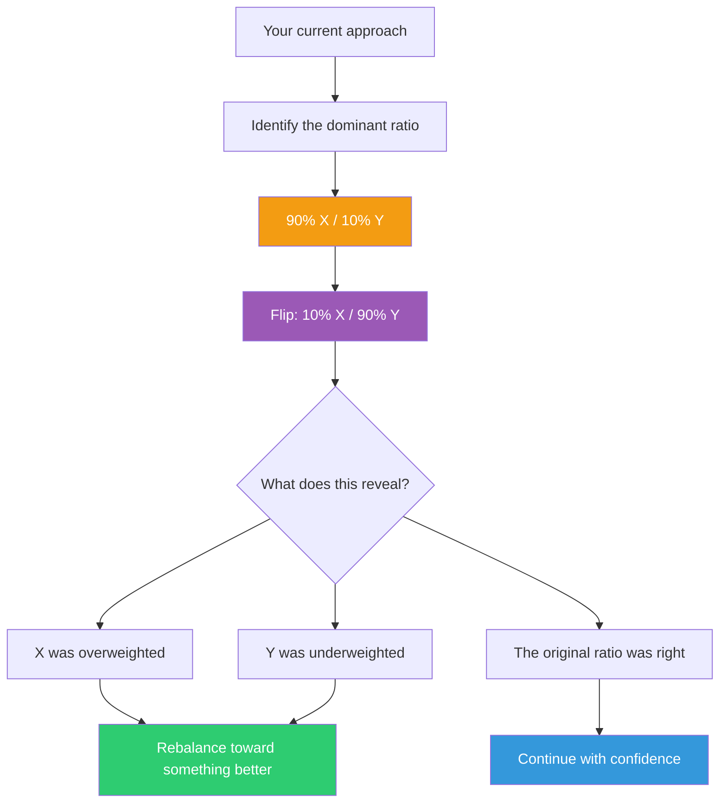

## The Move

Look at your current solution, process, or plan and identify the dominant ratio: what are you doing a lot of, and what are you doing a little of? Write it down as a rough percentage split. Now flip it. If you're 90% building and 10% testing, imagine 10% building and 90% testing. If your design is 80% features and 20% polish, imagine 20% features and 80% polish. Don't ask whether the flipped version is practical — ask what it reveals about your assumptions. The current ratio reflects an implicit belief about what matters. Flipping it forces that belief into the open.

## When to Use

- You inherited a process or plan and never questioned its proportions
- Effort feels misallocated but you can't articulate a better split
- You want to stress-test whether you're spending time on the right things
- A project is struggling and you suspect the priorities are wrong, not the execution

## Diagram

## Example

**Situation:** Your team is building a developer CLI tool. The split is roughly 85% feature development and 15% documentation. The tool has 40 commands and growing. User complaints are increasing.

**Flip the ratio:** Imagine 15% feature development, 85% documentation. You freeze features. The entire team spends a month writing tutorials, improving help text, adding examples to every command, creating a searchable cookbook, and building interactive onboarding.

**What it reveals:** The user complaints aren't about missing features — users can't find or understand the features that already exist. The tool doesn't need command #41. It needs the first 40 commands to be learnable. Flipping the ratio exposes that the team was treating "shipping features" as progress when the real bottleneck was comprehension.

**Result:** You don't actually go to 85/15 in favor of docs, but you shift to 50/50 for the next quarter. Feature velocity drops, but user satisfaction and adoption climb sharply.

## Watch Out For

- The flipped ratio is a thought experiment, not a prescription. You rarely want to actually invert the split — the insight is in what the flip reveals about your assumptions
- Watch for ratios that are invisible because they're baked into the process. "We spend 95% of standups on status updates and 5% on blockers" is a ratio nobody chose but everyone follows
- Some ratios are correct. If flipping it sounds absurd and teaches you nothing, the current balance might genuinely be right. That's a useful confirmation
- This move works on time, money, attention, headcount, code surface area — any resource that gets allocated in proportions
