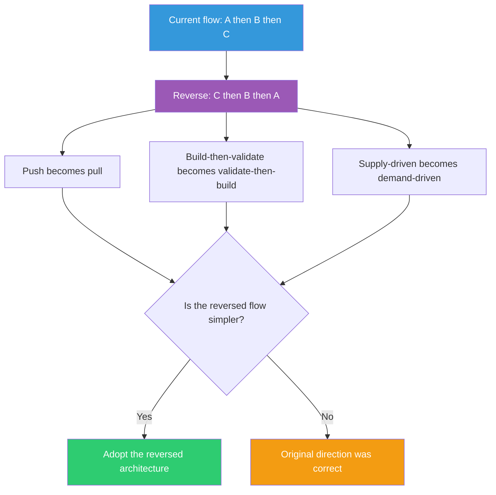

## The Move

Map out the current flow of your process or system: A leads to B leads to C. Now reverse the direction entirely. Start from the end and work backwards. If you're pushing, try pulling. If the system initiates, let the user initiate. If you're preprocessing data before use, try processing it at the point of use. If you're building then validating, try validating then building. Draw both flows side by side. The reversed version often eliminates intermediate stages that existed only to manage the complexity of the original direction. Look at how {{domain.1}} handles flow direction — push vs. pull, supply vs. demand — and see if their approach translates.

## When to Use

- Your pipeline or workflow has accumulated intermediate steps and feels over-engineered
- You're stuck on how to handle handoffs between stages
- The system uses a push model and you're fighting timing/ordering problems
- You want to explore fundamentally different architectures, not incremental improvements

## Diagram

## Example

**Situation:** Your e-commerce system processes orders like this: User places order, system validates inventory, system reserves stock, system calculates shipping, system charges payment, system sends confirmation, system notifies warehouse. Seven steps, sequential, and failures at step 5 require rolling back steps 2-4.

**Reverse the flow:** Start from the warehouse. The warehouse publishes what's available and ready to ship (with shipping costs pre-calculated per zone). The storefront shows only what's actually available. Payment is captured at browse-time as a pre-authorization. When the user clicks "buy," the warehouse claims the item — one step. Confirmation is the acknowledgment of the claim.

**What it reveals:** The original flow was supply-driven: "here's what we sell, and we'll figure out if we can actually deliver it after you buy." The reversed flow is demand-driven: "here's what we can actually deliver right now, pick from that." Most of the intermediate steps (inventory check, stock reservation, shipping calculation) existed to reconcile the gap between what was promised and what was possible. Reversing the flow eliminates the gap itself.

**Result:** You don't adopt the fully reversed architecture, but you move inventory validation and shipping calculation upstream into the browsing experience, cutting the checkout pipeline from 7 steps to 3 and eliminating the rollback problem entirely.

## Watch Out For

- Reversing the flow is a thinking tool, not a mandate. Sometimes the original direction is correct and the reversed version is worse. That's a valid finding
- Don't confuse the direction of data flow with the direction of control flow. You might reverse one without the other
- Some flows have a natural direction imposed by physics or causality (you can't un-send an email). Respect actual laws while questioning assumed directions
- This pairs with TF-033 (Work Backwards from the Output) but is more general — that card starts from the desired output, this card reverses any directional flow in the system
