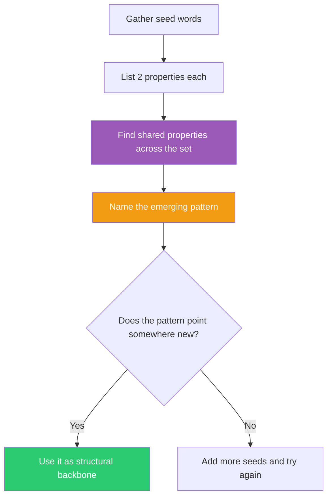

## The Move

Look at the seed words you've accumulated across your ThinkFu draws — or use these fresh ones: **{{word.1}}**, **{{word.2}}**, **{{word.3}}**. List each one. For every word, write down its two most essential properties. Now look across the set: what properties do they share? What metaphor do they form when taken together? Name the pattern in one phrase.

The seeds are random individually, but your brain will find a thread — and that thread often points somewhere your deliberate thinking hasn't gone. Use the emergent metaphor as a structural backbone for your idea.

## When to Use

- You've drawn multiple random words or concepts across a session and want to harvest them
- Your exploration feels scattered and you want an organizing principle that isn't top-down
- You trust associative thinking more than analytical thinking for this stage of the problem
- You have fragments that feel meaningful but you can't articulate why

## Diagram

## Example

**Problem:** "How should we structure the permissions model for our multi-tenant SaaS platform?"

**Seeds accumulated across the session:** *bridge*, *envelope*, *skeleton*

**Properties:**
- Bridge: connects two sides, bears load
- Envelope: contains and hides, has an intended recipient
- Skeleton: provides internal structure, is invisible from outside

**Shared properties:** All three are structural things that are defined by what they connect, contain, or support — not by themselves. They exist in service of something else.

**Named pattern:** "Invisible scaffolding"

**Applied to the problem:** The permissions model should be invisible scaffolding — users shouldn't see it, think about it, or configure it unless something goes wrong. It should be structural (like a skeleton), it should connect contexts (like a bridge between tenant spaces), and it should contain and route access (like an envelope with a recipient). This reframes the design away from "flexible permissions UI" toward "zero-config defaults with escape hatches." The metaphor killed the idea of a complex permissions dashboard and replaced it with convention-based access that only surfaces when you need to override it.

## Watch Out For

- Your brain is wired to find patterns even in pure noise. That's the feature, not a bug — but validate the pattern against your actual problem before committing to it
- Don't stretch. If three seeds genuinely have nothing in common, don't manufacture a connection. Add more seeds or re-roll
- The pattern is a *lens*, not an answer. It gives you a structural metaphor to organize ideas around — you still need to do the design work
- If you're working with seeds from earlier draws, include all of them, not just the ones that conveniently fit a narrative. The inconvenient seeds are often the most generative
