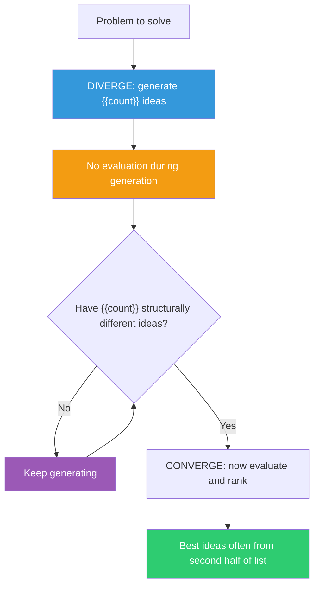

## The Move

You are about to pick a solution. STOP. You have not generated enough options. Set a hard minimum: generate at least **{{count}}** distinct approaches before evaluating ANY of them. Write them down as a numbered list. No judgment, no ranking, no "that won't work" filtering during generation.

The rule: each idea must be structurally different from the others, not a variation. "Use Redis" and "Use Memcached" are the same idea (external cache). "Use Redis" and "Precompute at write time so reads never need a cache" are different ideas.

Guilford's research shows the best ideas tend to appear in the second half of a generation session, after the obvious ones are exhausted. Your first 3 ideas are retrievals from memory. Ideas 7 through {{count}} require actual creative work.

## When to Use

- Before any decision where the cost of choosing wrong is high
- When the team has converged on an approach suspiciously quickly
- When you catch yourself evaluating ideas as you generate them
- When all your options feel like minor variations of the same thing

## Diagram

## Example

**Problem:** "Our mobile app's startup time is 4 seconds. We need it under 2."

**The trap:** The team immediately jumps to "lazy load the heavy modules" because that worked last time. That is ONE idea.

**Diverging (targeting {{count}} ideas):**
1. Lazy load heavy modules
2. Precompute the initial screen server-side, ship it as static HTML
3. Reduce the app to a single-screen launcher that loads the rest on demand
4. Profile and find the actual bottleneck (it might not be module loading)
5. Ship a lighter "instant" version for first launch, upgrade in background
6. Move initialization to a background thread using a worker
7. Cache the previous session's UI state and display it instantly while loading fresh data
8. Eliminate the splash screen — show a skeleton UI immediately
9. Preload the app during install or OS idle time via a system hook
10. Question the requirement: do users actually care about 4s, or is the PERCEIVED wait the problem?

Idea 7 (cached UI state) and idea 10 (reframe as perception problem) did not appear until the second half. Idea 10 might be the most valuable — it questions whether the technical problem is the real problem.

## Watch Out For

- Quantity is a means, not an end. After generating {{count}} ideas, you MUST converge. Infinite divergence is procrastination disguised as creativity
- The "no evaluation" rule is hard. Your brain will label ideas bad as you generate them. Write them down anyway. Evaluation comes later
- Variations do not count. If you find yourself listing "Redis, Memcached, DynamoDB DAX" as three ideas, you have one idea (external cache) with three implementations
- If you genuinely cannot reach {{count}} structurally different ideas, that itself is a signal. Your mental model of the solution space may be too narrow — try TF-004 (Import from Another Domain) or TF-009 (Random Entry)
