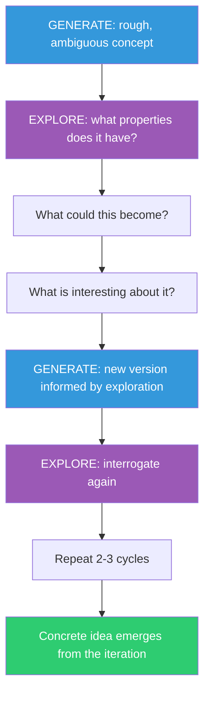

## The Move

Alternate between two phases. GENERATE: produce a "pre-inventive structure" — a rough, ambiguous, half-formed concept. It can be a sketch, a sentence fragment, a data flow with blanks, an interface with no implementation. Seed your pre-inventive structure with the shape/feel of {{word.1}}. Do not try to make it good or useful yet. Just make it concrete enough to examine.

EXPLORE: take that structure and interrogate it. What properties does it have? What could it become? What problems might it accidentally solve? What is interesting about it, even if it was not what you intended?

Then GENERATE again, informed by what you discovered. Repeat for 2-3 cycles. The key insight from Finke, Ward, and Smith's research: creative output improves when generation and evaluation are separated into distinct phases, and when the initial generation is deliberately ambiguous.

## When to Use

- You are sitting in front of a blank canvas and need to start somewhere
- You have vague creative intuitions that you cannot articulate yet
- Direct brainstorming ("think of a good idea") is producing nothing
- You need to explore a design space where you do not know what good looks like yet

## Diagram

## Example

**Problem:** "We need a new way for users to discover content in our app."

**Cycle 1 — Generate:** Sketch a rough concept: "What if the home screen was a map instead of a feed?" Don't evaluate yet. Just draw a literal map with pins on it.

**Cycle 1 — Explore:** What properties does a map have? Spatial proximity. Zooming. Landmarks. You can get lost. You can discover things by wandering, not searching. Interesting: "getting lost" is usually bad in UX, but in content discovery, it might be the point.

**Cycle 2 — Generate:** New structure informed by "getting lost is the point": a UI where the user has no search bar and no algorithm — they navigate spatially through a content landscape, where similar content clusters together.

**Cycle 2 — Explore:** This has a "browsing a bookstore" property. Serendipity is built in. But cold start is terrible — a new user sees a random landscape. What if the landscape reshapes itself around what they linger on?

**Cycle 3 — Generate:** An adaptive spatial interface where content clusters form and dissolve based on dwell time. The user "walks" through content, and the terrain shifts beneath them.

The final concept is not something anyone would have arrived at by saying "brainstorm content discovery ideas." It emerged from the iterative refinement of a vague shape.

## Watch Out For

- Do not skip the Explore phase. The temptation is to Generate, judge it bad, and Generate again. Exploration is where the value hides
- Pre-inventive structures should be ambiguous ON PURPOSE. If your first Generate output is fully specified, you have skipped ahead. Make it vaguer
- Two to three cycles is enough. More than that and you are polishing a concept instead of exploring the space
- This move produces raw creative material, not finished solutions. Follow up with evaluation (TF-015, TF-065) to stress-test what you have found
