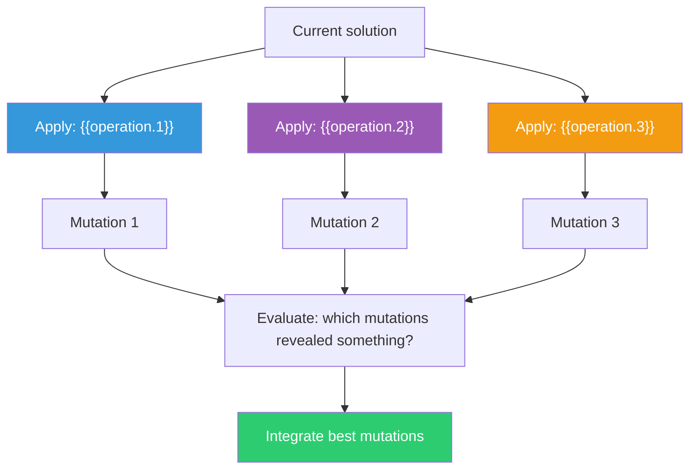

## The Move

Take your current solution and apply three SCAMPER transformations to it. For each one, force at least one concrete change — not a vague suggestion, but a specific mutation you could implement.

Your three operations are:

1. **{{operation.1}}**
2. **{{operation.2}}**
3. **{{operation.3}}**

For each: state the current component you are targeting, apply the transformation, and describe the result. Do not evaluate during application. Generate all three mutations first, then step back and ask which ones revealed something useful.

## When to Use

- You have a working solution and want to explore the space around it
- You need to generate variations for comparison or A/B testing
- The first draft is functional but feels like it could be better in a direction you cannot name
- You want a structured alternative to open-ended brainstorming

## Diagram

## Example

**Current solution:** A REST API for a task management app with endpoints for CRUD operations on tasks, lists, and users. Standard JWT auth, PostgreSQL backend, JSON responses.

**Operation 1 — "Eliminate: what could be removed entirely?"**
Target: the Lists entity. What if tasks have no lists? Instead, tasks auto-cluster by semantic similarity using embeddings. Users never manually organize — the system organizes for them. This is radically different and might be terrible, but it surfaces an insight: manual list management is a cost users pay, not a feature they love.

**Operation 2 — "Reverse: what could be flipped, inverted, or reordered?"**
Target: the request direction. What if the API pushes tasks to the client instead of the client polling? A WebSocket-first architecture where tasks arrive in real time. The "reverse" reveals that the polling model adds latency to the collaboration experience.

**Operation 3 — "Combine: what two parts could be merged into one?"**
Target: tasks and comments. What if a task IS a conversation thread, and the "task description" is just the first message? Completing a task is just resolving the thread. This merges the task tracker with team communication. It might explain why tools like Linear feel more natural than JIRA — they already lean toward this combination.

**Result:** Operation 3 is worth prototyping. The task-as-conversation model simplifies the data model and matches how teams actually work.

## Watch Out For

- Do not apply all seven SCAMPER operations in one session. Three is enough to generate useful variations without exhausting the approach
- Force concrete mutations, not vague gestures. "We could modify something" is not a mutation. "Make the task title a 280-character limit instead of unlimited" is
- Some operations will produce nonsense. That is expected. The value is in the 1-2 operations that produce genuine insight, not in all three being brilliant
- SCAMPER works on existing solutions. If you do not have a solution yet, use TF-063 (Diverge Before You Converge) or TF-064 (Geneplore Cycle) first
