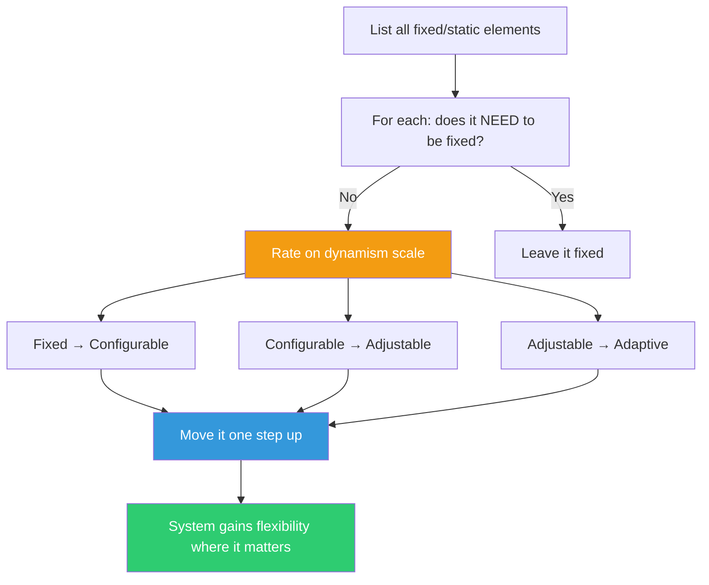

## The Move

List every fixed, hard-coded, or static element in your system: constants, configurations, algorithms, structures, interfaces, and workflows. For each one, ask: does this NEED to be fixed, or did we just make it fixed because it was easier? Rate each element on the dynamism scale: (1) Fixed — cannot change. (2) Configurable — can change at deploy time. (3) Adjustable — can change at runtime. (4) Adaptive — changes automatically based on context. Pick the element where the gap between current and needed dynamism is largest and most painful. Move it one step up the scale. As a provocation, also consider: what if {{constraint.1}} were applied — which rigid parts would HAVE to become dynamic?

## When to Use

- When requirements keep changing and the system can't keep up without code changes
- When you hard-coded a value early and it's now causing pain
- When different users or environments need different behavior from the same system
- When the system was designed for one context and is being forced into others

## Diagram

## Example

**Problem:** "Our rate limiter is set to 100 requests per minute for all users, and both power users and free-tier users are complaining."

**Static elements identified:**
1. Rate limit: fixed at 100 req/min (hard-coded constant)
2. Time window: fixed at 1 minute (hard-coded)
3. Response when limited: fixed 429 error (hard-coded)
4. Limit scope: fixed per-user (hard-coded)

**Dynamism assessment:**

| Element | Current | Needed | Gap |
|---|---|---|---|
| Rate limit value | Fixed (100) | Adjustable per tier | 2 steps |
| Time window | Fixed (1 min) | Configurable | 1 step |
| Throttle response | Fixed (429) | Adaptive (queue vs reject) | 3 steps |
| Limit scope | Fixed (per-user) | Configurable (per-user, per-endpoint, per-org) | 1 step |

**Biggest gap:** The throttle response. Instead of always returning 429, make it adaptive: for burst traffic, queue requests and process them slightly delayed. For sustained overuse, return 429 with a Retry-After header. For abusive patterns, escalate to a temporary block. The system responds differently based on the pattern it observes.

**Result:** Moving from "fixed reject" to "adaptive response" eliminated 70% of rate-limit complaints. Power users experiencing brief spikes get queued, not rejected. Abusive bots get blocked faster than before.

## Watch Out For

- Not everything should be dynamic. Every degree of dynamism adds complexity. Only dynamize what's causing real pain
- "Make it configurable" is the most common first step, but it can lead to config sprawl. Sometimes adaptive (automatic) is better than adjustable (manual)
- Increased dynamism means increased testing surface. A fixed system has one behavior to test; an adaptive one has many
- Don't confuse dynamism with indirection. Adding a config file that nobody ever changes isn't dynamism — it's complexity disguised as flexibility
