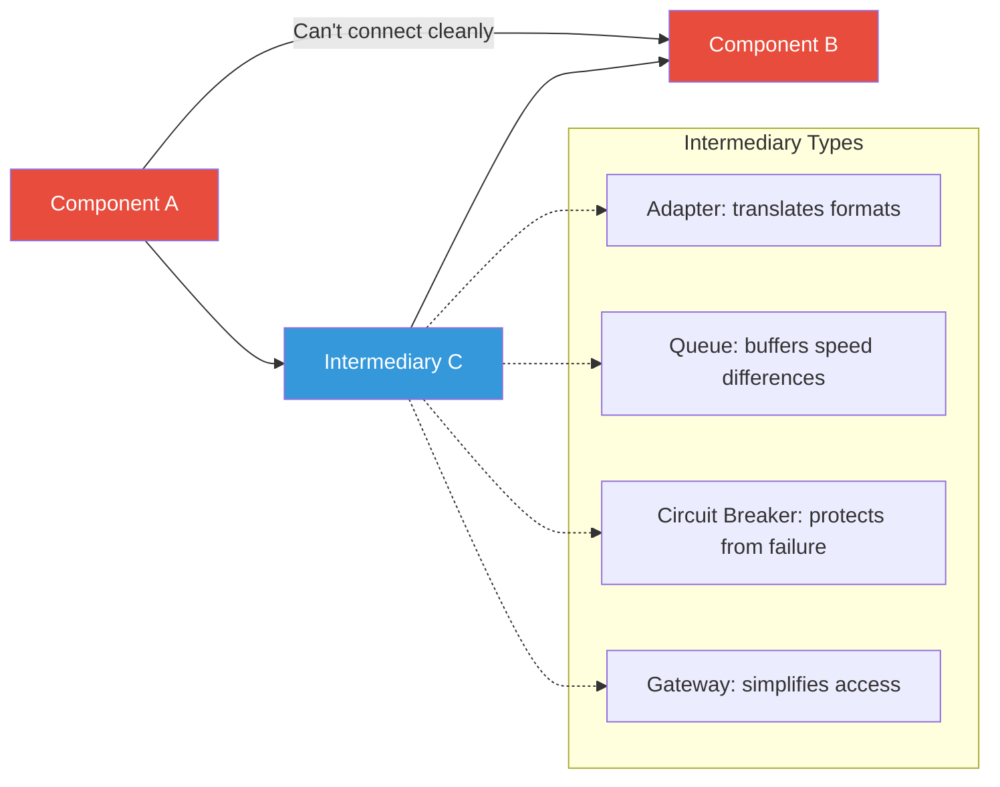

## The Move

Identify two components that need to interact but can't do so cleanly. Name the specific friction: incompatible formats? Different speeds? Coupling that makes changes risky? Different lifecycles? What intermediary does {{domain.1}} use for similar problems? Now design an intermediary — a third component whose only job is to sit between the two and resolve that friction. The intermediary can translate (adapter), buffer (queue), protect (circuit breaker), aggregate (gateway), or simplify (facade). Pick the intermediary type that matches your friction. The key principle: the intermediary is disposable and replaceable. Neither side should know or care about its internals.

## When to Use

- Two systems need to communicate but speak different protocols or formats
- A fast producer is overwhelming a slow consumer
- You need to insulate one system from changes in another
- A direct dependency creates a testing, deployment, or reliability problem

## Diagram

## Example

**Problem:** "Our frontend calls 12 microservices directly. Every time a backend team changes their API, the frontend breaks."

**Friction:** Direct coupling between frontend and 12 independently-evolving backends. Different change rates, different teams, different deployment schedules.

**Intermediary:** A Backend-for-Frontend (BFF) layer.

**Design:**
- The BFF exposes a single, frontend-optimized API
- Internally, it calls the 12 microservices and aggregates their responses
- When a backend API changes, only the BFF adapter for that service needs updating — the frontend contract stays stable
- The BFF also handles: response shaping (so the frontend gets exactly the data it needs), error normalization (every backend has different error formats), and caching (reducing redundant calls)

**Result:** Frontend deploys decoupled from backend deploys. Backend teams can evolve their APIs freely as long as the BFF adapter is updated. Frontend team works against one stable API instead of twelve unstable ones. Integration bugs dropped by 80%.

## Watch Out For

- An intermediary adds latency and a point of failure. Make sure the friction it resolves is worth the cost it introduces
- Avoid the "intermediary proliferation" trap: if you're adding intermediaries between intermediaries, something is wrong at a deeper level
- The intermediary should be thin. If it contains business logic, it's not an intermediary — it's a new service with its own responsibilities and lifecycle
- Don't use an intermediary to avoid fixing the root problem. If two systems are incompatible because one is badly designed, consider fixing the design instead of permanently papering over it
