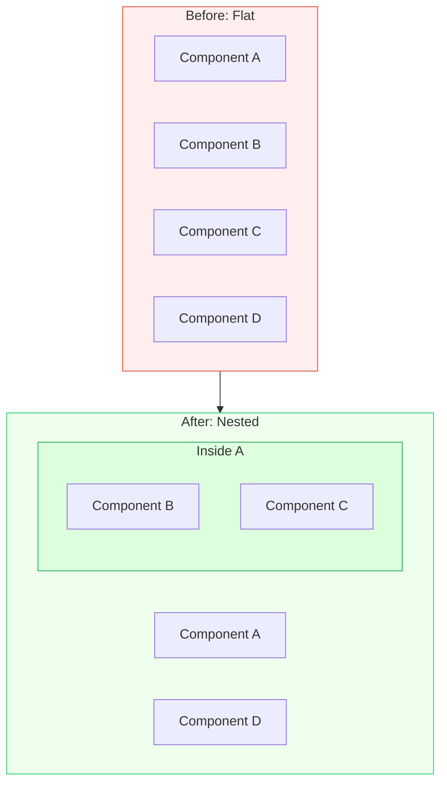

## The Move

Look at your system's components laid out flat. Ask: which of these has a natural "contains" relationship with another? A transaction contains operations. A request contains headers, body, and context. A test suite contains test cases. A pipeline contains stages. Take two components that are currently peers and make one the container of the other. Then check: does nesting reduce the number of things the outer world needs to know about? If nesting hides complexity behind a single interface, it's the right move. If it just adds depth without reducing surface area, undo it.

## When to Use

- A flat list of components is getting hard to manage
- Two components share so much context that passing it between them feels redundant
- You need to scope or isolate behavior so changes don't leak
- The system would benefit from encapsulation — hiding internals behind a boundary

## Diagram



## Example

**Problem:** "Our middleware chain has 8 flat middleware functions: auth, rate-limit, logging, cors, body-parser, validation, error-handler, and response-formatter. Adding or reordering them keeps breaking things."

**Nesting analysis:**
- Auth, rate-limit, and cors are all "gateway concerns" — they decide whether the request proceeds
- Body-parser and validation are "input processing" — they prepare the request for handling
- Logging, error-handler, and response-formatter are "output concerns" — they wrap around the response

**Nested structure:**
```
Gateway middleware (auth, rate-limit, cors)
  -> Input middleware (body-parser, validation)
    -> Handler
  -> Output middleware (error-handler, response-formatter, logging)
```

**Result:** Three conceptual middleware groups instead of eight individual functions. Each group manages its own ordering internally. Adding a new gateway concern (like IP allowlisting) means modifying one group, not reasoning about where it goes in a flat list of eight. The outer world sees three stages, not eight steps.

## Watch Out For

- Nesting adds depth. Too much depth (more than 3-4 levels) creates its own navigation problem — you trade horizontal complexity for vertical complexity
- Don't nest things that genuinely are peers. Forcing a hierarchy where none exists creates misleading structure
- Nesting implies ownership. If B is nested inside A, A is responsible for B's lifecycle. Make sure that ownership relationship is real, not just cosmetic
- Watch for the "package-per-layer" trap: nesting by technical layer (controllers, services, models) is usually worse than nesting by domain (users, orders, payments)
