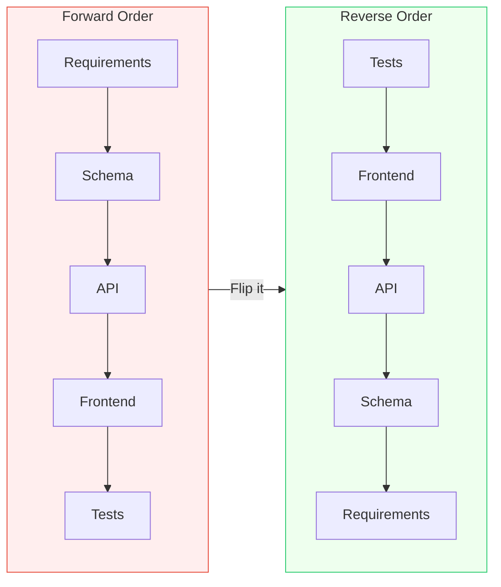

## The Move

Write out your current process as a sequence of steps. Now reverse the order entirely. If your process is "gather requirements, design schema, build API, write frontend, test," try: "write the test, build the frontend, write the API, design the schema, discover the requirements." This isn't random — working backwards from the end product means every earlier step is constrained by what actually matters: the output. For each reversed step, ask: does doing it in this order reveal anything the forward order hid? Which intermediate steps turn out to be unnecessary when you start from the end?

## When to Use

- You're stuck partway through a sequential process and can't move forward
- You know exactly what the end result should be but not how to get there
- The process feels over-designed with steps that might not be necessary
- You want to test whether the order of operations matters or is just habit

## Diagram

## Example

**Problem:** "We need to build a reporting dashboard. The team wants to start by designing the data warehouse schema."

**Forward order:** Design data warehouse schema -> Build ETL pipelines -> Create data models -> Build API -> Build dashboard UI -> User testing.

**Reversed:** User testing -> Build dashboard UI -> Build API -> Create data models -> Build ETL pipelines -> Design data warehouse schema.

**What reversing reveals:**
1. **Start with user testing:** Interview users about what reports they actually need. Turns out they need 4 specific reports, not a general-purpose analytics platform.
2. **Build dashboard UI:** Mock the 4 reports with hard-coded data. Users validate the visualizations and filters they actually want.
3. **Build API:** Design endpoints that serve exactly what the UI needs — no more, no less. This is 6 endpoints, not a generic query API.
4. **Create data models:** Only model the data the 6 endpoints require. Skip the other 40 tables the "comprehensive" schema would have included.
5. **Build ETL:** Only ingest the data the models need. Three data sources instead of twelve.
6. **Design schema:** The schema designs itself — it's exactly the shape the models require.

**Result:** The reversed process built only what was needed. The forward process would have built a general-purpose data warehouse serving a dashboard that shows 4 reports. 80% of the warehouse would have been unused.

## Watch Out For

- Reversing is a thinking tool, not always a literal prescription. You probably can't literally test before building, but you can write the test expectations to clarify what "done" means
- Some processes have genuine dependencies that can't be reversed (you can't deploy before you compile). Focus on the steps where order is convention, not physics
- Don't reverse just to be contrarian. If the forward order is working fine, leave it alone
- The biggest insight from reversal is usually which steps are unnecessary, not which order is "better"
