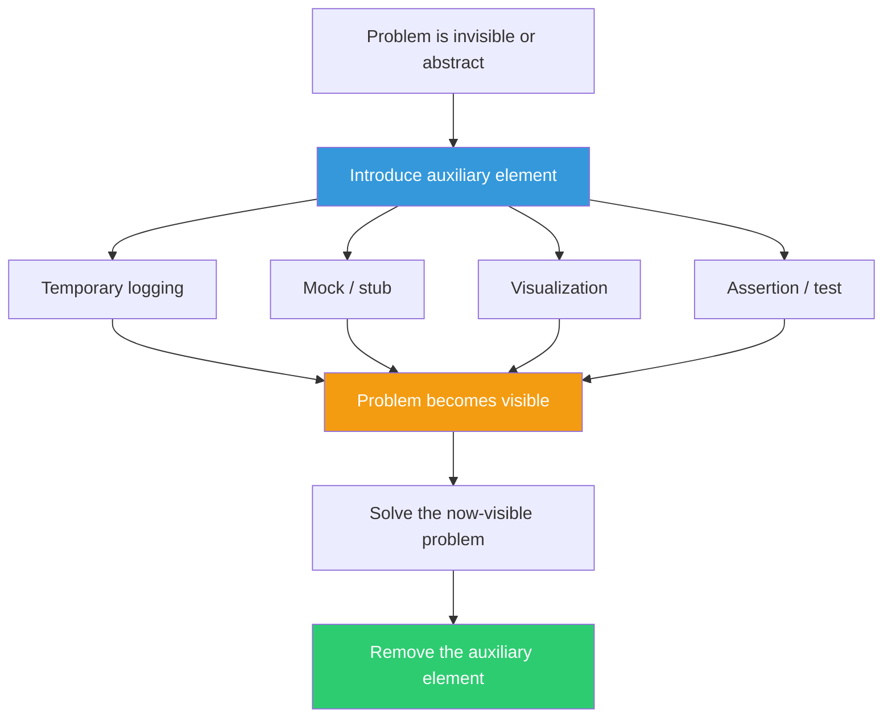

## The Move

You're stuck because the problem is invisible, abstract, or too complex to hold in your head. Introduce something temporary that makes the problem visible or tractable. In geometry, these are construction lines — lines you draw to create relationships that aren't obvious in the original figure. In software, these are: temporary logging that traces execution flow, a mock that simulates a dependency so you can test in isolation, a visualization that renders data structures, a print statement that dumps intermediate state, a test that encodes your assumption so you can watch it fail. The auxiliary element is not part of the solution. It's scaffolding you remove once the building stands. As a lateral prompt: what if "{{word.1}}" were somehow the auxiliary element — what would it make visible?

## When to Use

- You can't understand the system's behavior from reading code alone
- The bug is in the interaction between components, not in any single component
- The data has a shape you need to see before you can reason about it
- You've been reasoning abstractly and need to ground your thinking in something concrete

## Diagram

## Example

**Problem:** "Users report that search results are sometimes wrong, but I can't reproduce it and the code looks correct."

**The invisible problem:** Search involves a query parser, a filter chain, a relevance scorer, and a result ranker. The bug is somewhere in the interaction between these four components, but each one looks correct in isolation.

**Auxiliary elements introduced:**

1. **Intermediate state logger:** Added temporary logging between each stage that dumps the full query object and result set. Deployed to staging with a debug flag.

2. **Snapshot test:** Captured the exact query from a user's bug report and wrote a test that asserts the expected result at each stage: after parsing, after filtering, after scoring, after ranking.

3. **Side-by-side visualization:** Built a quick HTML page that shows the result set after each pipeline stage, with highlighting for items that changed position.

**What the auxiliary elements revealed:** The snapshot test passed through parsing and filtering but failed at scoring. The visualization showed why: when a search query contained an accent character, the relevance scorer was comparing against unaccented index terms and scoring them as zero relevance. The filter kept them (substring match) but the scorer killed them (exact-match scoring).

**Fix:** Normalize accents before scoring. Remove all three auxiliary elements.

**What we learned:** The bug was invisible because it only appeared in the interaction between the filter (lenient) and the scorer (strict). No amount of reading the code would reveal it — you had to watch data flow through the pipeline.

## Watch Out For

- Remove auxiliary elements when you're done. Temporary logging that becomes permanent is how systems accumulate noise
- Don't let the auxiliary element change the behavior you're observing. Logging that alters timing can mask or create race conditions (Heisenbug)
- The goal is insight, not infrastructure. If your "temporary visualization" is taking three days to build, you've crossed from scaffolding into a project
- Sometimes the best auxiliary element is the simplest: a single print statement beats a distributed tracing setup when the bug is in one function
