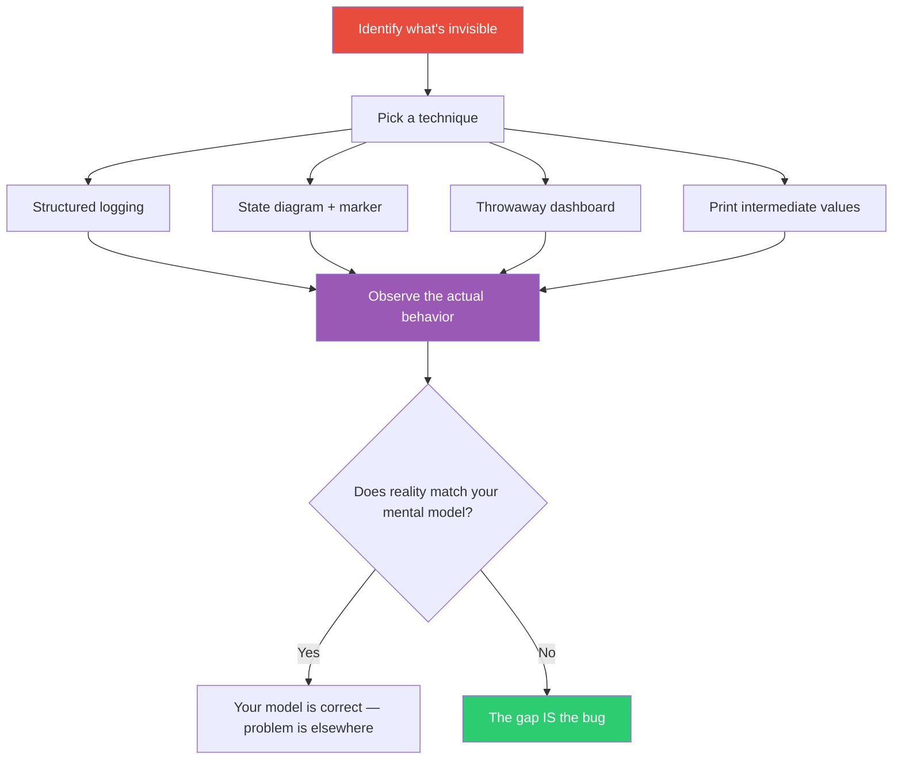

## The Move

Identify the thing in your system you cannot currently see: the data flowing between services, the state transitions in a workflow, the decision points in an algorithm, the timing of concurrent operations. Now make it visible. Add a structured log that you can scan. Draw a state diagram and mark where you are in it. Build a throwaway dashboard. Print every intermediate value. Dump the call tree. The technique doesn't matter — what matters is converting invisible runtime behavior into something your eyes can process. Victor's principle: creators need immediate connection to what they create. If you can't see the effect of a change in real time, you're working blind.

## When to Use

- You're debugging something and your mental model of the system disagrees with reality
- You've been reasoning about behavior but haven't actually observed it
- A system "should work" based on the code but doesn't, and you can't see why
- You're designing something with internal state that users (or you) never see

## Diagram

## Example

**Situation:** A developer is building a collaborative document editor. Users report that edits sometimes "disappear" — they type something, see it briefly, then it vanishes. The operational transform (OT) logic passes all unit tests.

**Making the invisible visible:** Instead of reading the OT code again, the developer adds a real-time overlay to the editor that shows: (1) every operation generated locally, with a timestamp, (2) every operation received from the server, with a timestamp, and (3) the transform result when local and remote operations collide. The overlay is an ugly semi-transparent panel on the right side of the editor.

**What became visible:** When two users type simultaneously, the local operation is generated at T=0, the remote operation arrives at T=150ms, and the transform runs. But occasionally the remote operation arrives BEFORE the local operation's server acknowledgment — and the OT code was applying the transform against the wrong base state. This was invisible in the unit tests because they assumed operations arrived in order. The developer could see the race condition happening in real time, with timestamps, and fixed it in 20 minutes.

## Watch Out For

- The visualization is disposable. Don't over-engineer it. A console.log with a prefix you can grep for is a perfectly valid visualization
- Choose the right granularity. Logging every variable is as useless as logging nothing — you need the level that shows the behavior you can't see
- Sometimes the thing that's invisible is invisible for a reason — it's in a third-party library, a hardware layer, or a network hop you don't control. In that case, make the boundaries visible: what goes in and what comes out
- Remove the visualization when you're done. Debug overlays that ship to production are a cliche for a reason
