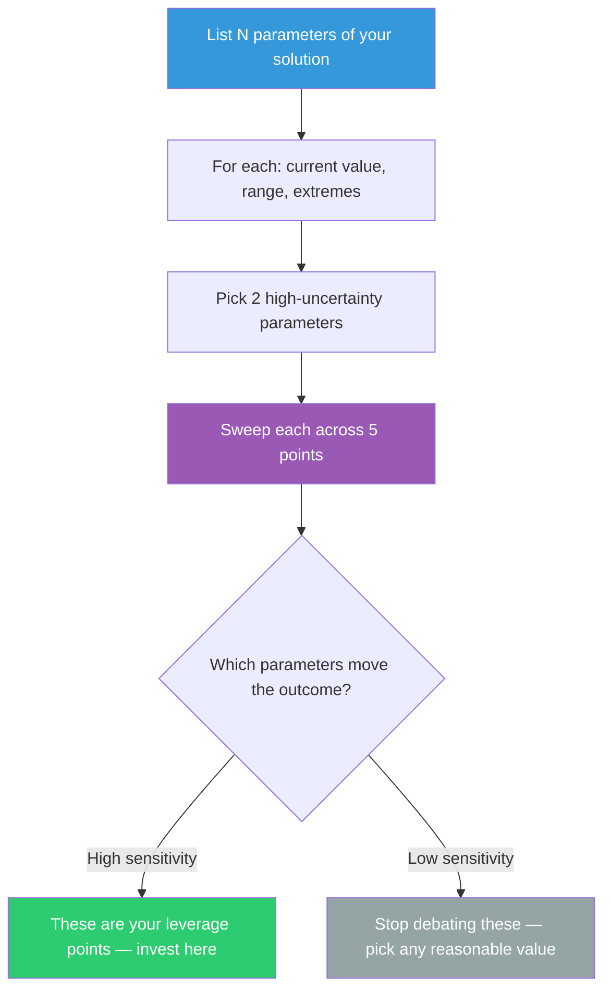

## The Move

List {{number}} parameters of your current solution — values you chose but could have chosen differently. These might be explicit (a timeout of 30 seconds, a batch size of 100, a retry count of 3) or implicit (the number of microservices, the choice of SQL over NoSQL, the decision to process synchronously). For each parameter, write down: the current value, the range of plausible values, and what happens at the extremes. Now sweep at least two of them: imagine the solution at 5 different points across each range. Which parameters change the outcome dramatically? Those are your leverage points. Which parameters barely matter? Stop agonizing over those.

## When to Use

- You shipped a v1 with default values and never revisited them
- A design review keeps debating a specific number without data on alternatives
- You want to know which decisions are high-leverage before investing in optimization
- The solution "works" but you suspect better configurations exist in unexplored territory

## Diagram

## Example

**Situation:** A team has designed a job queue system with these settings: 10 worker threads, 5-second polling interval, 3 retries on failure, 60-second timeout per job, and a batch size of 50. Nobody remembers why these specific numbers were chosen. The system works but sometimes falls behind.

**Exploring the parameter space (5 parameters):**

| Parameter | Current | Range | At minimum | At maximum |
|-----------|---------|-------|------------|------------|
| Workers | 10 | 1-100 | Massive backlog, throughput drops 90% | CPU saturated at 40, no gain past that |
| Poll interval | 5s | 0.1s-30s | Latency drops from 5s to 0.1s, DB load doubles | Latency spikes to 30s, DB load drops to nothing |
| Retries | 3 | 0-10 | Poison jobs fail immediately (good), transient errors aren't recovered (bad) | Poison jobs block the queue for 10 minutes |
| Timeout | 60s | 5s-600s | Fast jobs fine, ML inference jobs always fail | Zombie workers hold slots for 10 minutes |
| Batch size | 50 | 1-500 | One job per poll = extreme overhead | 500 jobs per poll = memory spikes, all-or-nothing failure |

**Sweep results:** Workers and poll interval were the only high-sensitivity parameters. Increasing workers to 30 and decreasing poll interval to 1s eliminated the backlog entirely. The team had spent two meetings debating retry count (low sensitivity) while ignoring the two parameters that actually mattered.

## Watch Out For

- Not all parameters are independent. Sweeping two parameters simultaneously can reveal interactions that sweeping them individually misses. If you have time, try a 2D sweep of the two most sensitive ones
- Beware of parameters that are low-sensitivity in normal operation but high-sensitivity at the edges. A retry count of 3 vs. 5 doesn't matter until you have a network partition
- Some "parameters" are actually architectural decisions in disguise. "Number of microservices" looks like a number but changing it restructures the entire system. Separate tunable parameters from structural choices
- Don't just think about it — actually run the sweep if you can. Mental models of parameter sensitivity are frequently wrong
