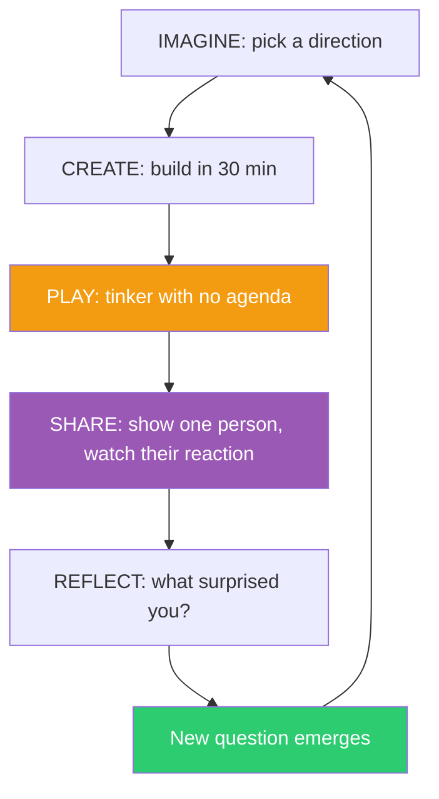

## The Move

Run one full cycle of the creative learning spiral. (1) IMAGINE: state what you want to explore — not a spec, a direction. (2) CREATE: build the fastest possible prototype — 30 minutes max, ugly is fine. (3) PLAY: use your prototype with no agenda. Don't test it against requirements. Tinker. Try things the spec didn't mention. Ask "what if I..." and try it. Spend at least as long playing as you spent building. (4) SHARE: show it to one person and watch their face, not their words. What surprised them? What did they try that you didn't expect? (5) REFLECT: write three sentences — what surprised you, what you'd change, and what new question emerged. Then IMAGINE again — the new question is your next starting point.

## When to Use

- You're starting a new project and the temptation is to plan everything before building anything
- You've built something but skipped straight to formal testing without exploring it
- The iteration cycle feels like debugging rather than learning
- You need to generate genuine novelty, not just fix bugs

## Diagram

## Example

**Situation:** A developer is building a CLI tool for querying log files. She has a spec: support regex search, date filtering, and JSON output.

**Running the spiral:**

1. **Imagine:** "I want to explore what it feels like to search logs interactively."
2. **Create:** She builds a bare-bones CLI in 25 minutes — regex search only, no date filter, no JSON output. Just `logsearch "pattern" file.log` printing matching lines with color-highlighted matches.
3. **Play:** She tries it on her own production logs. She searches for "error" — gets 10,000 lines. Tries "error.*timeout" — much better. She notices she keeps running the same search with slight variations. She wonders: what if it showed a histogram of matches over time instead of the raw lines? She hacks in a quick `--histogram` flag that shows match counts per hour as ASCII bars. It takes 10 minutes and it's ugly.
4. **Share:** She shows a teammate. He immediately tries `--histogram "error"` and then `--histogram "error.*timeout"` side by side. "Oh cool, the timeouts spike every day at 3 AM. Can I overlay two patterns?" She hadn't thought of that.
5. **Reflect:** "The histogram is more useful than the raw log lines. The real use case isn't reading logs — it's seeing patterns over time. Multi-pattern overlay is the killer feature."

**Result:** The original spec (regex + date filter + JSON) would have produced a competent but forgettable tool. The spiral revealed that temporal pattern visualization — not line-by-line searching — was the actual unmet need. The spec was rewritten around histograms and overlays.

## Watch Out For

- The PLAY step is the one most likely to be skipped. It feels unproductive. It's the most important step. If your "play" has a test plan, you're not playing — you're testing
- CREATE must be time-boxed ruthlessly. If the prototype takes 3 days, you won't have the emotional distance to throw it away. 30 minutes to 2 hours maximum
- SHARE doesn't mean demo. Don't present — hand it over and watch. The value is in seeing what someone else does with it, not in showing them what you did
- The spiral is not waterfall with different labels. Each cycle should take hours, not weeks. If you're on cycle 1 after a month, the cycles are too big
