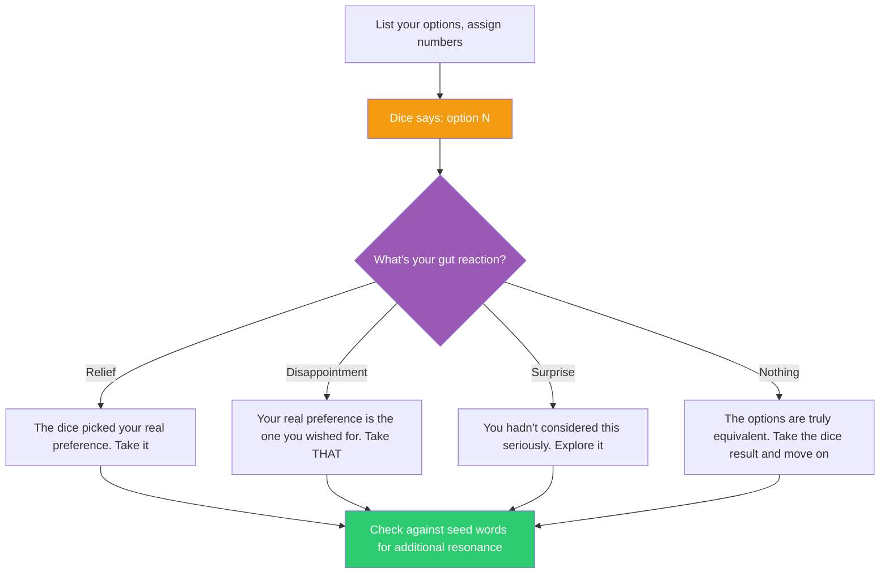

## The Move

List your options (up to 6). Assign each a number. The dice rolled {{number}} — that's your chance-selected option. Now: do NOT automatically take it. Instead, notice your immediate gut reaction. Relief means the dice picked what you secretly wanted. Disappointment means you now know what you actually prefer — it's the one you wished the dice had landed on. Surprise means you hadn't seriously considered this option and should. Cage used the I Ching not because chance was wise, but because it revealed what the artist actually wanted by removing the burden of justification. Use the seed words **{{word.1}}**, **{{word.2}}**, **{{word.3}}** as additional provocations — do any of them resonate with or challenge the chance result?

## When to Use

- You've been comparing options for too long and the analysis isn't converging
- The options are close enough in quality that the decision is more emotional than rational
- You suspect your analytical mind is rationalizing against what your intuition wants
- You need to break decision paralysis and get moving

## Diagram

## Example

**Situation:** A tech lead is choosing between three database options for a new service: (1) PostgreSQL — safe, familiar, boring. (2) DynamoDB — scalable, unfamiliar, vendor lock-in. (3) SQLite — simple, unconventional for a server, might not scale.

**Chance operation:** She assigns 1-2 = PostgreSQL, 3-4 = DynamoDB, 5-6 = SQLite. The dice rolls {{number}}.

Let's say the result points to DynamoDB. Her immediate reaction: a sinking feeling. She realizes she doesn't want to learn a new query model right now. But she also notices she didn't feel relief at the idea of PostgreSQL — she felt boredom. The option she WISHED the dice had picked? SQLite. She's been dismissing it as "not serious" but her gut wants the simplicity.

**Seed word check:** The words {{word.1}}, {{word.2}}, {{word.3}} arrive. She looks for resonance. If a word like "foundation" or "root" appears, it reinforces the simplicity argument. If something like "bridge" or "scale" appears, it challenges the SQLite choice and pushes her to reconsider.

**Result:** She starts with SQLite, with a clear migration path to PostgreSQL if scale requires it. The chance operation revealed that "not serious enough" was social pressure, not engineering judgment. She'd been optimizing for what she could defend in a review, not what was actually right for the project.

## Watch Out For

- This is a preference-revelation tool, not a decision-making tool. Never take the random result blindly for high-stakes decisions. The value is in your reaction, not the dice
- If you feel genuinely nothing — no relief, no disappointment, no surprise — the options really are equivalent. Take the dice result and invest your decision energy elsewhere
- Don't re-roll. The temptation to "best of three" defeats the entire purpose. One roll, one reaction, one insight
- This works poorly for decisions with large information asymmetry. If you don't understand the options well enough to have preferences, gather more information first — don't roll dice
