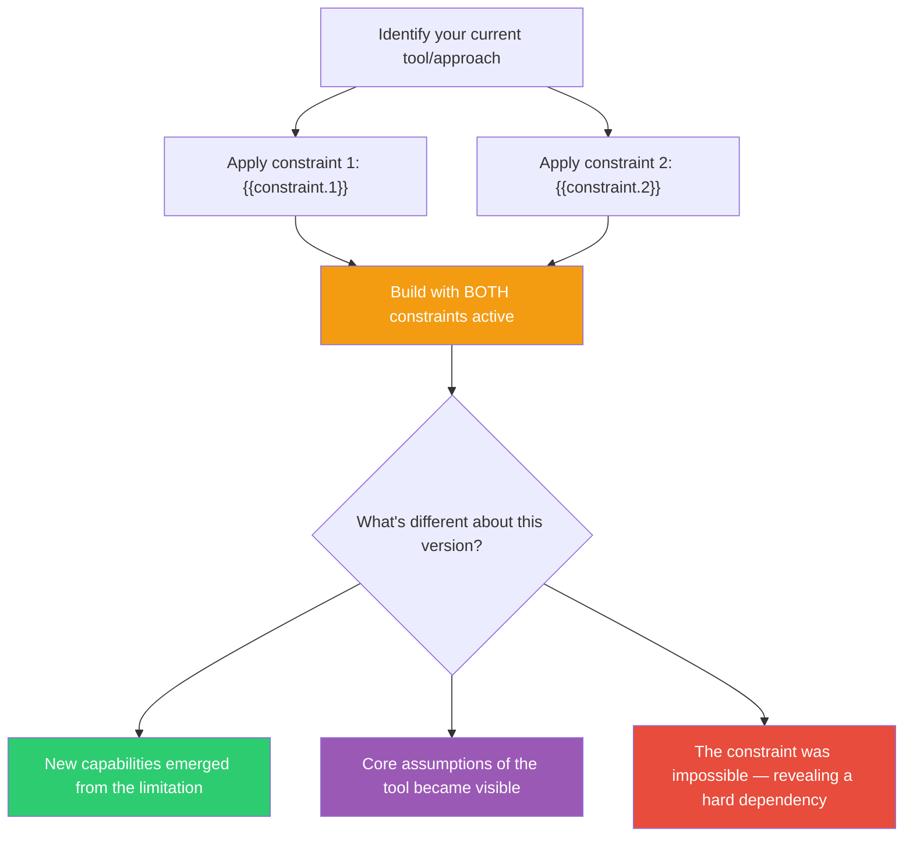

## The Move

Take the tool, language, framework, or process you're currently using. Now "prepare" it — add constraints that transform how it works, the way Cage placed bolts and rubber between piano strings to create entirely new sounds from a familiar instrument. Your two drawn constraints are: **{{constraint.1}}** and **{{constraint.2}}**. Apply BOTH simultaneously to your current approach. Don't switch tools — that's too easy. Keep the same tool but make it behave differently. A database where you can only use one table. A programming language where every function must be under 5 lines. A design process where you can't use any words. The constraint transforms the output while the process stays familiar. Build a prototype under both constraints. What does the constrained version reveal about your unconstrained assumptions?

## When to Use

- You're defaulting to the same patterns and want to break out
- The solution space is too wide and you need boundaries to be creative within
- You want to discover unconventional uses for familiar tools
- A team brainstorm is producing predictable ideas and needs a jolt

## Diagram

## Example

**Situation:** A frontend developer always builds SPAs with React, Redux, and a component library. Every project ends up with the same architecture: component tree, global state store, API layer. She wants to explore different interaction patterns for a new internal tool.

**Drawn constraints:** Suppose the constraints are "no persistent state" and "must work offline."

**Preparing the instrument:** She keeps React but: (1) No persistent state — no Redux, no useState that persists across renders, no localStorage. Every interaction must be computed from the current URL and the user's input. The app is essentially a pure function from URL to UI. (2) Must work offline — all data ships with the app, no API calls.

**What the prepared instrument produced:** A tool that encodes its entire state in the URL hash — every view is a shareable, bookmarkable link. All reference data is bundled as a static JSON file. The tool loads instantly, works without internet, and every state is a URL you can paste in Slack. She'd never have designed this voluntarily — it violates every SPA convention she knows — but the prepared instrument produced something genuinely better for an internal tool where shareability and speed matter more than real-time data.

## Watch Out For

- If a constraint is literally impossible (e.g., "no electricity" for a software project), interpret it metaphorically. "No electricity" might mean "what if the system had to work with zero compute budget — could the answer be a spreadsheet or a paper process?"
- The point isn't to ship the constrained version. The point is to discover what the constraints reveal about your defaults. Take the insights back to the unconstrained version
- Two constraints at once is the sweet spot. One is too easy to work around. Three is usually contradictory to the point of paralysis
- Don't pick constraints that align with what you'd do anyway. The value comes from constraints that fight your habits. Random selection prevents cherry-picking
