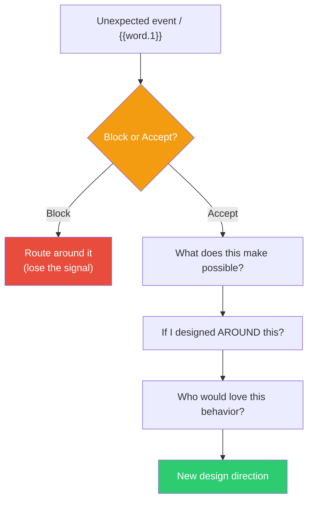

## The Move

Identify the unexpected thing that just happened — a bug, a weird user behavior, a constraint change, a surprising test result, or simply the random word **{{word.1}}**. This is the "offer." Now, instead of blocking it (dismissing, ignoring, routing around), deliberately ACCEPT it. Ask three questions: (1) What does this make possible that my original plan didn't? (2) If I designed the system around this surprise instead of against it, what would change? (3) Who would love this behavior?

## When to Use

- An unexpected constraint or event just disrupted your plan
- Users are using your system in a way you didn't intend
- A test failure reveals behavior you didn't expect
- You need a creative prompt and want to use the random word as an "offer" from the universe
- You notice yourself reflexively dismissing or routing around something surprising

## Diagram

## Example

**Situation:** You're building a note-taking app. During testing, you notice that when users paste a URL, the parser sometimes grabs surrounding text and includes it as a quote block. This is a bug — the parser is too greedy.

**Block response:** Fix the parser to only grab the URL. File a bug ticket. Move on.

**Accept response:** Wait — users are accidentally creating quote blocks alongside their links. What if that's useful? What if pasting a URL automatically pulled a preview snippet from the page and inserted it as a quote? The "bug" is a feature sketch. The greedy parser was pointing toward a behavior users might actually want — contextual link previews.

**Outcome:** Instead of just fixing the parser, you build a link-preview feature that fetches a snippet from the URL and inserts it as a collapsible quote. The "bug" became the product's most-used feature.

## Watch Out For

- Not every surprise is a gift. Accept the offer to EXPLORE it, but you still evaluate afterward. The point is to investigate before dismissing, not to ship every accident
- "Accept the offer" is hardest when you're under time pressure and the surprise feels like a setback. That's exactly when the offer is most valuable
- If using the random word as the offer, spend at most 3 minutes. If nothing emerges, the word wasn't the right stimulus — re-roll or move on
- The opposite failure mode: accepting EVERY offer leads to scope creep and lack of direction. Accept selectively, but investigate generously
