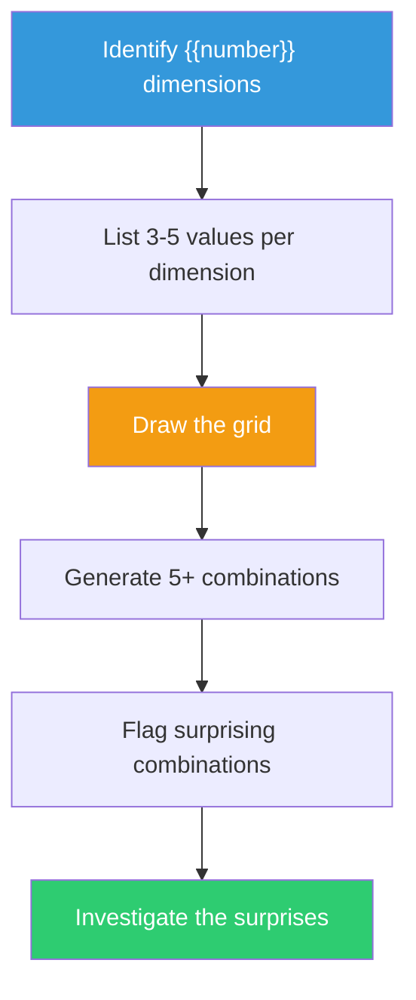

## The Move

Decompose your problem into **{{number}}** independent dimensions — the axes along which a solution can vary. For each dimension, list 3-5 possible values (concrete options, not vague categories). Draw a grid with dimensions as rows and values as columns. Now generate combinations: pick one value from each row, either randomly or by deliberately choosing unusual pairings. Each combination is a candidate solution. Generate at least 5 combinations. Most will be mediocre. One or two will surprise you — those are the ones to investigate.

## When to Use

- You're exploring a large solution space and keep gravitating toward the same corner
- The problem has clear independent dimensions (who, how, when, where, with-what)
- Brainstorming produces incremental variations instead of genuinely different approaches
- You want to ensure you've covered the space systematically, not just associatively
- You're designing a product, API, or system with multiple independent design choices

## Diagram

## Example

**Problem:** "How should we notify users when their long-running job completes?"

**Dimensions (4):**

| Dimension | Value 1 | Value 2 | Value 3 | Value 4 |
|-----------|---------|---------|---------|---------|
| **Channel** | Email | In-app push | SMS | Webhook |
| **Timing** | Immediately | Batched daily | On next login | Predictive (before completion) |
| **Content** | Status only | Status + summary | Full results inline | Link to results |
| **Trigger** | Every job | Only failures | Only long jobs (>5 min) | User-configured |

**Obvious combination:** Email + Immediately + Status + Every job. (This is what most teams build first.)

**Surprising combinations:**
- Webhook + Predictive + Full results inline + User-configured: An API-first approach where power users get a webhook with predicted completion time and results pushed directly to their pipeline. This is a developer-experience play — turns notifications into an integration point.
- In-app push + On next login + Status + summary + Only long jobs: Don't interrupt. When the user returns, show a digest of what finished while they were away, but only for jobs that actually took long enough to matter. Low noise, high signal.

The morphological box surfaced the "predictive + webhook" combination that nobody proposed in the original brainstorm — because the team was stuck in the "email notification" corner of the space.

## Watch Out For

- Choose genuinely INDEPENDENT dimensions. If changing one dimension forces a change in another, they're not independent — merge them or rethink the decomposition
- The grid produces many nonsensical combinations. That's fine. You're looking for 1-2 surprising viable ones, not validating every cell
- Don't spend too long listing values. 3 per dimension is enough to break the pattern. Perfectionism in the grid defeats the purpose
- The hardest part is identifying the dimensions. If you're struggling, ask: "What are the independent decisions I need to make?" Each decision is a dimension
