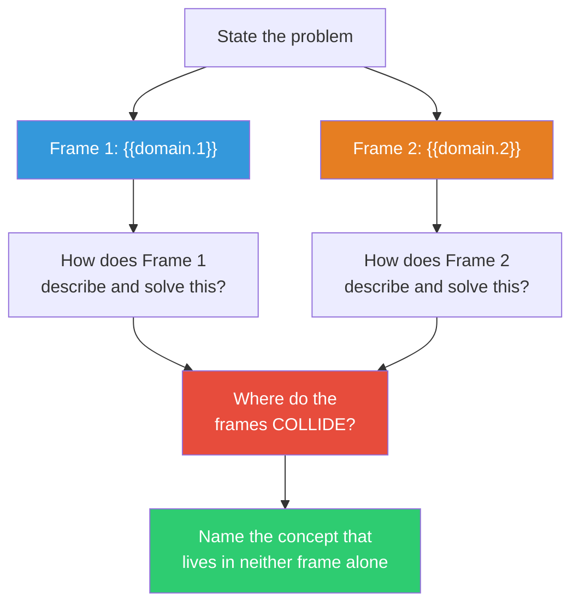

## The Move

State your problem clearly. Now place it simultaneously in two unrelated frames: **{{domain.1}}** and **{{domain.2}}**. This is not analogy (mapping your problem into one frame). This is bisociation — holding both frames active at the same time and looking for the interference pattern. For each frame, ask: how would this domain describe my problem? What vocabulary would it use? What solution would it reach? Now look at where the two frames COLLIDE — the concepts that mean something different in each frame, the places where one frame's solution contradicts the other's. The creative insight lives in the collision, not in either frame alone.

## When to Use

- Single-domain analogies have been useful but insufficient
- You need a genuinely novel concept, not an adaptation of an existing one
- The problem sits at the boundary between two kinds of thinking
- You want to generate ideas that surprise even the person generating them
- You've exhausted the obvious approaches and need a conceptual leap

## Diagram

## Example

**Problem:** "How do we manage technical debt in a fast-growing codebase?"

**Frame 1: Ecology.** An ecologist sees technical debt as dead organic matter — fallen leaves, dead trees. In a healthy forest, decomposition is continuous. Fungi, bacteria, and insects break down dead matter and return nutrients to the soil. Debt is natural and necessary. The problem isn't debt existing; it's when decomposition stops — when dead matter accumulates faster than the ecosystem can process it.

**Frame 2: Jazz music.** A jazz musician sees technical debt as dissonance. Dissonance isn't a mistake — it creates tension that drives the music forward. But dissonance must RESOLVE. Unresolved dissonance isn't jazz; it's noise. The musician's skill is knowing when to introduce dissonance and when to resolve it, maintaining a ratio of tension to release.

**The collision:** Ecology says debt is dead matter that must be decomposed continuously. Jazz says debt is dissonance that must be resolved rhythmically. The interference pattern: technical debt isn't a backlog to be "paid down" (the accounting metaphor everyone uses) — it's a RHYTHM. You introduce debt (dissonance) deliberately when you need speed, and you resolve it (decomposition) continuously, not in periodic "cleanup sprints." The healthy ratio isn't zero debt — it's a steady pulse of creation and decomposition.

**Novel concept:** "Debt rhythm" — instrument the codebase to measure the creation-to-resolution ratio of technical debt per sprint. When the ratio tilts toward accumulation, that's the signal to shift — not because you've scheduled a cleanup sprint, but because the rhythm is off.

## Watch Out For

- Bisociation requires holding two frames simultaneously, which is cognitively harder than analogy. If you find yourself dropping one frame and just working in the other, you've slipped into analogy. Pull the second frame back
- The collision often feels uncomfortable or nonsensical at first. That's the signal it's working. Don't retreat to comfort
- Not every frame pair produces useful interference. If 10 minutes yields nothing, re-roll the domains. The quality of bisociation depends on the frames being genuinely unrelated
- The concept that emerges needs to be translated back into your actual domain to be useful. Don't fall in love with the metaphor — extract the structural insight and express it in domain-native terms
