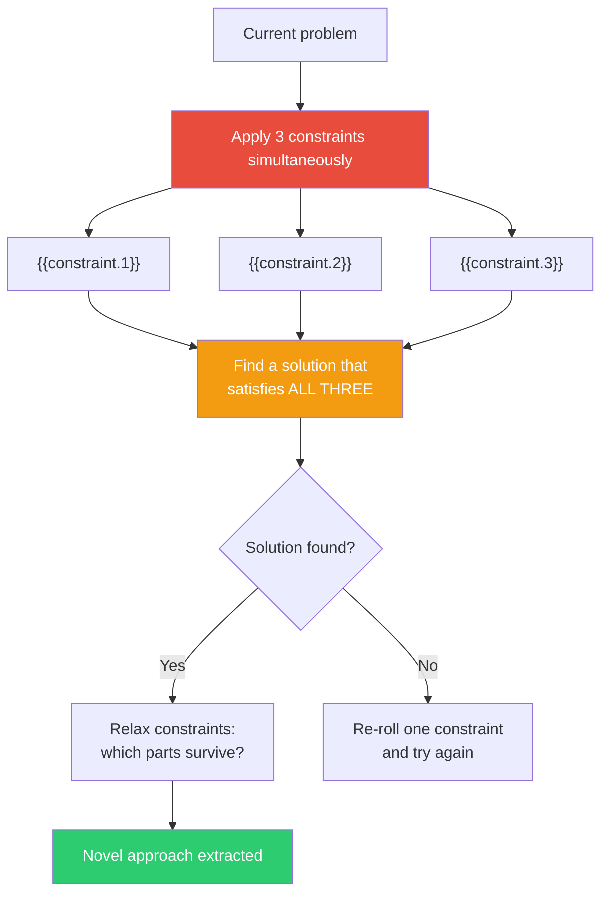

## The Move

Take your current problem and impose three simultaneous constraints: (1) **{{constraint.1}}**, (2) **{{constraint.2}}**, (3) **{{constraint.3}}**. Now find a solution that satisfies ALL THREE at once. Do not relax any constraint. Do not solve for one at a time. The power is in the simultaneity — three constraints together eliminate the entire space of obvious solutions and force you into territory you wouldn't visit voluntarily. If the constraints feel impossible together, good — the solution that resolves the "impossible" combination is the creative breakthrough.

## When to Use

- You have too much freedom and it's producing mediocre, safe ideas
- The problem space feels flat — all approaches seem equally valid and equally boring
- You need to rapidly eliminate the obvious and find something genuinely novel
- You're stuck and need artificial pressure to break the pattern
- You want to stress-test whether a creative solution exists under extreme conditions

## Diagram

## Example

**Problem:** "We need to build an onboarding flow for our developer tool."

**Constraints applied:**
1. *Must work without any documentation*
2. *Must be completable in under 2 minutes*
3. *Must teach the user something they didn't know before*

**Obvious approaches eliminated:** A tutorial wizard (takes too long). A docs link (violates constraint 1). A video walkthrough (takes too long). A tooltip tour (doesn't teach anything new). A sample project (takes too long to explore).

**What survives:** An interactive challenge. Drop the user into a real (but sandboxed) scenario with a broken configuration. The tool's error messages guide them to fix it. In 90 seconds they've debugged a real problem, learned how the config works, and experienced the tool's error-reporting flow — which is the thing they'll use most. No docs. Under 2 minutes. They learned something. All three constraints satisfied.

**Relax and extract:** The "interactive debugging challenge" concept survives even when you relax the time constraint. The constraints led to a fundamentally different onboarding philosophy: don't TELL people how the tool works, let them DISCOVER it by fixing something. This idea wouldn't have emerged from an unconstrained brainstorm because "just write a tutorial" is the path of least resistance.

## Watch Out For

- The constraints are scaffolding, not the final spec. Once you've found the creative insight, relax the constraints and see which parts of the solution survive. The goal is the insight, not literal compliance
- If all three constraints together produce genuinely nothing after 10 minutes, replace ONE constraint and try again. The art is in choosing constraints that are tight enough to eliminate the obvious but not so tight that nothing exists
- Don't cheat the constraints. "Must work without documentation" doesn't mean "write the documentation but call it something else." The creative pressure only works if you take the constraints seriously
- Artificial constraints can produce artificial solutions. After the exercise, evaluate the result on its own merits, not just on how cleverly it satisfies the constraints
