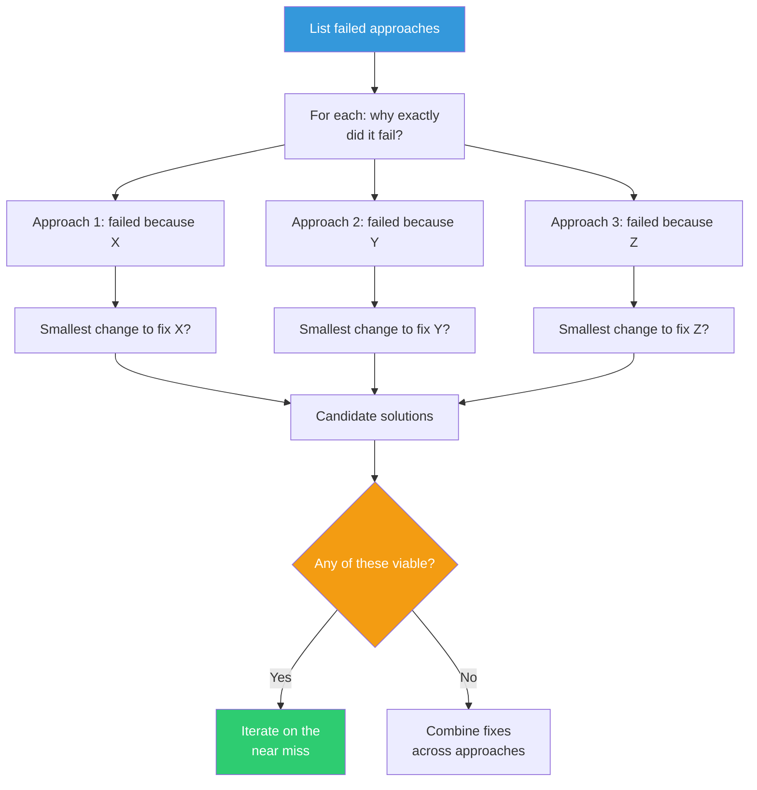

## The Move

List every approach you have tried that did not work. For each one, write down specifically why it failed — not vaguely ("it didn't work") but precisely ("it solved the read path but doubled write latency"). Now, for each failed approach, ask: "What is the smallest single change — one inversion, one removal, one reframing — that would fix the specific reason it failed?" The solution space is not uniform. Wrong answers and right answers cluster together; the distance between a near miss and a breakthrough is often one variable.

## When to Use

- You have tried multiple approaches and none succeeded
- You are about to discard a pile of "failed" work and start over
- A prototype almost works but has one critical flaw
- You sense the answer is nearby but cannot find it

## Diagram

## Example

**Problem:** "We need a notification system that's real-time but doesn't overwhelm users."

**Failed approaches:**
1. **WebSocket push for everything** — Failed because users got 50+ notifications per hour during active periods. Why: no aggregation.
2. **Digest email every hour** — Failed because critical notifications (deploy failures) arrived too late. Why: no priority differentiation.
3. **User-configurable rules** — Failed because nobody configured them; defaults were either too noisy or too quiet. Why: required user effort.

**Smallest flips:**
1. WebSocket push + aggregate by source, batch non-critical into 5-minute windows. One change: add time-windowed batching.
2. Digest email + instant push for P0 events only. One change: add a priority tier.
3. Configurable rules + smart defaults that learn from dismissal patterns. One change: make the defaults adaptive, not static.

**Result:** Approach 1's flip (time-windowed batching with instant P0 bypass) combines the strengths of all three. The answer was one variable away from the first attempt.

## Watch Out For

- Be specific about why something failed. "It didn't work" is not actionable. "It violated our latency budget by 3x on writes" is
- Don't force a near miss to work if the failure is fundamental, not incidental. Some approaches are wrong in kind, not just in degree
- This move assumes you have actually tried things. If you're still in planning mode, you don't have near misses yet — use a different move
- Watch for sunk cost bias. Just because you've invested in an approach doesn't mean it's the nearest miss
