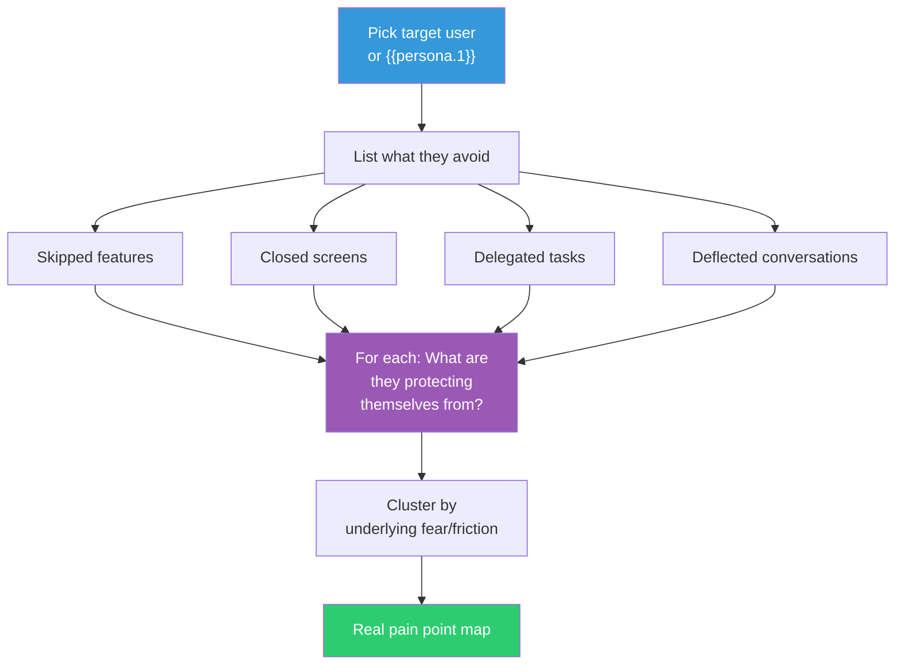

## The Move

Choose your target user — or, if you lack real data, imagine **{{persona.1}}**. List everything they actively avoid: features they skip, screens they close immediately, tasks they delegate or postpone, conversations they deflect, settings they never touch, documentation they never read. For each avoidance, ask: "What are they protecting themselves from?" Avoidance is more honest than aspiration. People lie about what they want; they rarely lie about what they avoid. Cluster the avoidances by underlying fear or friction, and you have a map of real pain points — often very different from the stated ones.

## When to Use

- User research and usage data tell contradictory stories
- You built what was requested and adoption is low
- You need to find hidden pain points that users have adapted around
- You want to understand the emotional landscape of your product, not just the functional one

## Diagram

## Example

**Target user:** Senior backend engineer onboarding to a new team.

**Avoidance behaviors observed:**
1. Never opens the architecture diagram in Confluence (avoids it even when linked)
2. Asks teammates directly instead of reading runbooks
3. Skips the "getting started" script and sets up manually
4. Avoids the team's shared IDE config and uses their own
5. Never attends the optional "system walkthrough" meetings

**Underlying pattern:** They are not avoiding documentation — they are avoiding *feeling incompetent*. The existing onboarding materials are written for someone who already understands the system's mental model. Engaging with them surfaces how much they don't know, in a visible way (Confluence tracks who viewed what, asking "basic" questions in public channels).

**Real pain point:** The problem is not "bad docs" — it is "docs that make smart people feel dumb." The fix is not better documentation; it is *private, low-stakes* onboarding: a self-paced sandbox, anonymous Q&A, or 1:1 pairing sessions where not-knowing is expected.

## Watch Out For

- Don't pathologize avoidance. Sometimes people avoid things because those things are genuinely bad, not because of some hidden psychology
- Avoidance mapping requires real observation or good data. Imagined avoidance patterns are just your assumptions in disguise
- Be careful with the {{persona.1}} fallback. A fictional persona gives you hypotheses, not findings. Validate with real behavior data as soon as possible
- Avoidance can be cultural or contextual. What looks like avoidance in one context may be efficiency or preference in another
