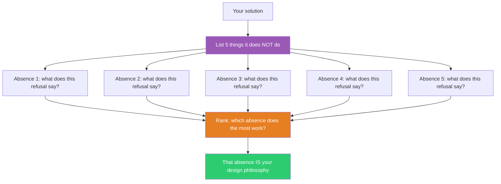

## The Move

List 5 things your solution deliberately does NOT do — not things it fails at, but things it *refuses* to do. For each absence, write one sentence explaining what that refusal communicates about your design's values. Then apply the constraint **{{constraint.1}}** — does this constraint reveal a sixth absence you missed? Now rank the absences: which one is doing the most design work? That absence is likely more important than half your features. If you cannot list 5 deliberate absences, your solution has no point of view — it is trying to be everything, which means it is nothing.

## When to Use

- Your solution feels like a feature checklist with no identity
- You can explain what it does but not what it stands for
- Competitors all look the same and you need differentiation
- The design review keeps adding things and never subtracting

## Diagram

## Example

**Problem:** "We're building a team messaging app and the feature list keeps growing — threads, reactions, video calls, file sharing, integrations, bots, scheduled messages..."

**5 deliberate absences:**
1. **No threads.** We refuse to let conversations fork — every message lives in one flat stream per channel. This says: we value simplicity over organization.
2. **No read receipts.** We refuse to tell you who read your message. This says: we value low-pressure communication.
3. **No integrations marketplace.** We refuse to become a platform. This says: we are a tool, not an ecosystem.
4. **No video calls.** We refuse to replace your meeting tool. This says: we are for asynchronous communication only.
5. **No message editing after 5 minutes.** We refuse to let you rewrite history. This says: we value authenticity over polish.

**Ranking:** "No video calls" does the most design work — it defines the entire product category. It is the absence that makes the product coherent. Every feature decision flows from "we are async-only."

**Result:** Instead of a Slack clone with 80% of the features, you have a product with a clear identity. The absences ARE the pitch: "The messaging app that respects your focus time."

## Watch Out For

- Do not confuse "things we haven't built yet" with "things we refuse to do." This move is about intentional absence, not backlog items
- If every absence feels painful, you may be building too broad a product. That is the finding, not the failure
- Absences only work if users can feel them. An absence nobody notices is not design restraint — it is just a missing feature
- Revisit your absence list quarterly. Some refusals stop being strategic and become stubborn
