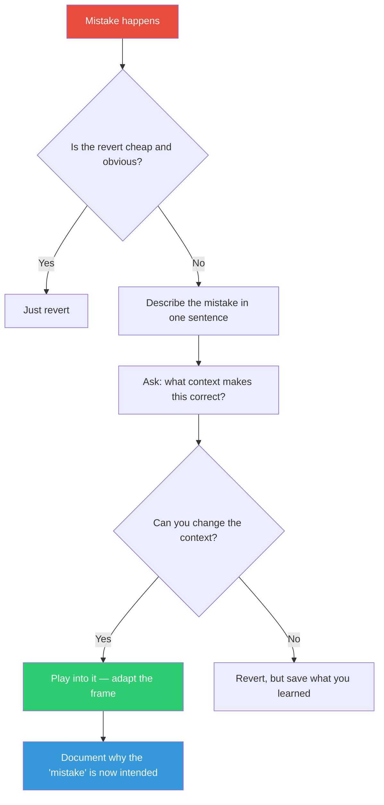

## The Move

You have made a mistake — wrong output, wrong behavior, wrong direction. Before you revert, pause. Describe the mistake in one sentence. Now ask: "What context would make this output correct?" Can you change the surrounding system, the framing, or the requirements so the mistake becomes an intended behavior? If the cost of recontextualizing is lower than the cost of reverting, play into the mistake. Miles Davis did not hear a wrong chord — he heard an unresolved chord, and he resolved it.

## When to Use

- A bug shipped and users adapted to the "broken" behavior
- You built Feature A when the spec said Feature B, but Feature A is interesting
- A data migration went sideways and the new shape has unexpected advantages
- The revert cost (lost time, user disruption, coordination) exceeds the cost of adapting

## Diagram

## Example

**Situation:** Your team built a search API that returns results sorted by "last modified" instead of "relevance" as specified. It shipped to production on Friday. On Monday you discover the mistake — but also discover that user engagement with search results is up 15%.

**The revert path:** Roll back the sort order, re-deploy, notify users of the change. Cost: half a day of engineering, user disruption, and you lose the engagement bump.

**Play into it:** Users prefer fresh results over "relevant" results because in this domain (internal knowledge base), recency IS relevance. The "mistake" revealed a product insight the spec missed.

**The move:** Change the spec, not the code. Document that "last modified" is the intended default sort. Add a toggle for "relevance" sort as a secondary option. Ship a release note calling it a "new feature."

**Result:** A half-day revert becomes a zero-cost insight. The spec was wrong, not the code.

## Watch Out For

- This is not an excuse to avoid fixing genuine bugs. If the mistake causes data loss, security issues, or user harm, revert immediately
- Playing into a mistake requires honesty about WHY you are keeping it. "It's too hard to revert" is laziness. "The mistake revealed a better design" is the legitimate version
- Document the recontextualization. Future team members should know this was an intentional adaptation, not a bug everyone forgot about
- Do not play into the same mistake twice. If the process that produced the error is not fixed, you will get a less charming mistake next time
