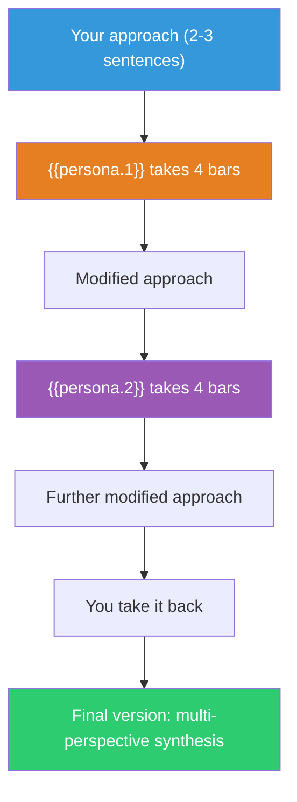

## The Move

State your current approach in 2-3 sentences. Now hand it to **{{persona.1}}**: what would they change, add, or emphasize? Write their modification in 2-3 sentences — this is their "four bars." Do not evaluate yet. Now hand the modified version to **{{persona.2}}**: what do they change, add, or emphasize? Write their modification. Finally, take it back yourself: given what both perspectives added, what is your final version? The constraint is critical: each round must BUILD on the previous one, not start over. Short turns prevent any single perspective from dominating.

## When to Use

- You are working solo and need to simulate diverse viewpoints
- The solution optimizes for one stakeholder at the expense of others
- You want structured perspective-shifting, not open-ended brainstorming
- The design feels technically sound but one-dimensional

## Diagram

## Example

**Problem:** "Design an alerting system for a microservices platform."

**Your approach:** "Send PagerDuty alerts when error rates exceed 2x baseline for 5 minutes. Group related alerts by service. On-call engineer triages."

**{{persona.1}} (a UX designer) takes four bars:** "Show the on-call engineer a visual diff of what changed in the last hour alongside the alert — deployment, config change, traffic spike. Don't just say 'errors are up,' show WHY they might be up. Reduce cognitive load at 3am."

**{{persona.2}} (a CFO) takes four bars:** "Add cost-awareness to the alert. If the error rate is up but it's only affecting 0.1% of traffic on a non-revenue endpoint, maybe it's a P2, not a page. Tie alert severity to business impact, not just technical thresholds."

**You take it back:** "The alerting system sends pages based on business-impact thresholds (not just error rates), includes a visual context panel showing recent changes and traffic patterns, and auto-classifies severity by revenue impact. The technical alert becomes a decision-support screen."

**Result:** Three rounds turned a standard alerting setup into a context-rich, business-aware incident response tool. The UX perspective added context; the finance perspective added prioritization.

## Watch Out For

- Each persona must BUILD on what came before, not discard it. If {{persona.2}} ignores {{persona.1}}'s contribution, the chain breaks
- Choose personas that are genuinely different from your own perspective. Two technical personas trading fours just produces more of the same
- Keep each round to 2-3 sentences. The constraint forces prioritization — each persona can only change the most important thing
- This is a generation move. The final synthesis may still need evaluation — Trade Fours produces a richer draft, not a finished design
