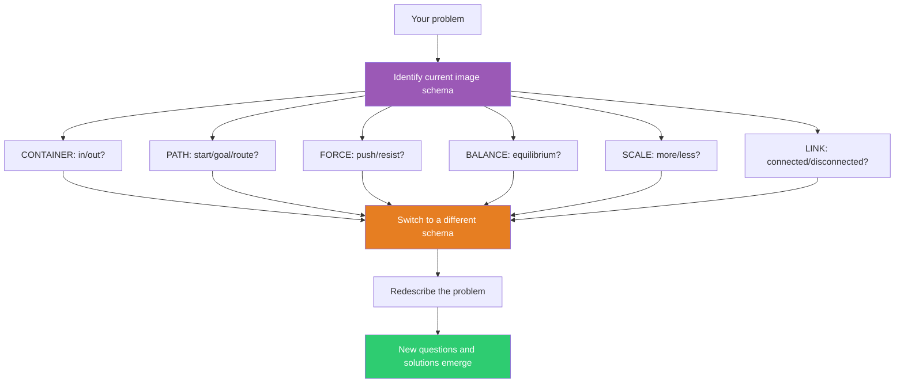

## The Move

Identify which **image schema** structures your current understanding of the problem. The six core schemas are:

- **CONTAINER** — things are in or out, boundaries, inclusion/exclusion
- **PATH** — start point, goal, route, obstacles, progress
- **FORCE** — push, resist, pressure, momentum, friction
- **BALANCE** — equilibrium, weight, tipping point, symmetry
- **SCALE** — more/less, bigger/smaller, ranking, degree
- **LINK** — connection, disconnection, binding, dependency

Name yours. {{word.1}} suggests which schema to shift to — is it a CONTAINER, a PATH, a FORCE? Then deliberately switch to a different schema and redescribe the problem. If you see CONTAINER (what's inside/outside the system boundary?), try PATH (where are we trying to get to?). If PATH (we're stuck on the route), try BALANCE (what's out of equilibrium?). If FORCE (too much pressure), try LINK (what's connected that shouldn't be?). Each schema generates different questions and different solutions.

## When to Use

- When your understanding of the problem feels locked into one spatial structure
- When you need a systematic way to generate genuinely different framings
- When the team keeps using the same spatial language ("we're stuck," "it's overflowing," "it's unbalanced")
- When you want to go deeper than surface-level reframing

## Diagram

## Example

**Problem:** "Our monolith is too big. We need to break it apart into smaller services. Some components should be inside the service boundary, others outside."

**Current schema:** CONTAINER. You're thinking about boundaries, inclusion, what goes in which box. Solutions: draw service boundaries, define what's inside vs. outside each microservice, enforce encapsulation.

**Switch to PATH:** "Where is a request trying to get from and to? What's the route? Where does it get stuck?" Now you're mapping request flows, not boundaries. You discover that 80% of requests follow just 3 paths, and those paths cross every proposed service boundary. The container decomposition was clean, but the paths are tangled. Solution: decompose along *paths* (user journeys), not containers (domain entities).

**Switch to FORCE:** "What forces are pushing on this system? Where is the pressure? Where is the friction?" Now you see that the real pressure is on the deployment pipeline — one team's changes block everyone else. Solution: decompose along *deployment independence*, not domain boundaries. The force schema reveals the operational pressure the container schema couldn't see.

**Switch to LINK:** "What's connected that shouldn't be? What's disconnected that should be linked?" Now you map the actual runtime dependencies and find that two "separate" modules share a database table and can't be deployed independently. The link schema exposes coupling the container schema assumed away.

Three different schemas, three different decomposition strategies. The container schema was the default but produced the least useful decomposition.

## Watch Out For

- You're usually not aware of your image schema until you try to name it. Listen to the spatial language in your descriptions — "inside," "path," "pressure," "balance," "bigger," "connected" — each word is a schema fingerprint.
- Not every schema will be productive for every problem. Try two switches. If neither opens anything new, the current schema may actually be the right one.
- Image schemas can combine. "We're on a path and hitting a wall" uses both PATH and FORCE. Decompose the combination — which schema is dominant? Switch the dominant one.
- This is a thinking tool, not a presentation tool. Use the schema shift to generate new insights, then describe your solution in plain language.
