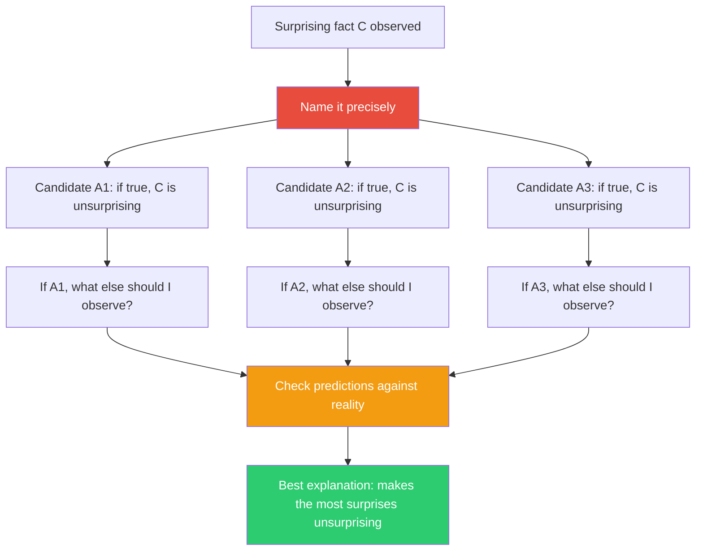

## The Move

Peirce's formula: "The surprising fact **C** is observed. But if **A** were true, **C** would be a matter of course. Hence, there is reason to suspect **A** is true."

What would surprise someone in {{domain.1}} about this? That's your entry point. Name the surprising fact. Write it down precisely. Now generate **three candidate explanations** — three different "A"s that would make this surprise unsurprising. For each candidate, ask: "If this explanation were true, what ELSE would I expect to observe?" Check those predictions. The explanation that correctly predicts the most *other* observations — especially other things that were also surprising — is your strongest lead.

## When to Use

- When you observe something your current model doesn't predict
- When an anomaly in data, behavior, or system output resists easy explanation
- When you've been ignoring a surprising result because it doesn't fit your narrative
- When debugging and the symptoms don't match any known failure mode

## Diagram

## Example

**Surprising fact:** Your SaaS application's error rate spikes every Tuesday at 2 PM. Not Monday. Not every day. Just Tuesday, 2 PM, for the last 6 weeks.

**Candidate A1:** "A cron job runs at 2 PM Tuesday."
- If true, you'd also expect higher CPU usage at that time. You check — CPU is flat. A1 weakened.

**Candidate A2:** "A specific customer does a weekly bulk import on Tuesdays."
- If true, you'd expect the errors to come from a single tenant. You check — 94% of Tuesday errors trace to one customer account. A2 strengthened. You'd also expect the spike started when that customer onboarded. You check — the customer onboarded 7 weeks ago. Spike started 6 weeks ago (their first full week). A2 explains both the timing and the start date.

**Candidate A3:** "Tuesday 2 PM is when traffic peaks because of a weekly marketing email."
- If true, you'd expect higher overall traffic, not just errors. Traffic is normal. A3 eliminated.

A2 wins — it makes the Tuesday timing, the single-tenant error pattern, and the 6-week start date all unsurprising. You investigate the customer's bulk import and find they're sending 50,000 records with malformed date fields. The fix is input validation, not infrastructure.

## Watch Out For

- The most dangerous response to a surprising fact is "that's weird" followed by moving on. If it surprised you, your model is incomplete. That's information.
- Generate at least three candidates. The first explanation that occurs to you is biased by availability — it's the most familiar failure mode, not necessarily the right one.
- The best explanation isn't always the simplest. It's the one that makes the most other surprising things also unsurprising. Unifying power matters more than parsimony.
- Abduction generates hypotheses, not proofs. After identifying the best candidate, you still need to test it. Abduction tells you where to look, not what you'll find.
