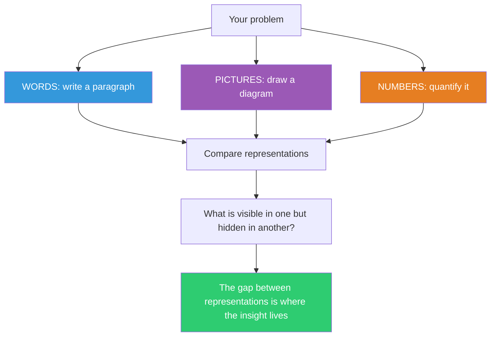

## The Move

Express your current problem in three different formats. (1) WORDS: write a one-paragraph narrative explaining the problem as if telling a colleague. (2) PICTURES: draw a diagram — boxes and arrows, a flowchart, a state diagram, a timeline, whatever fits. (3) NUMBERS: quantify it — how many, how often, how large, what ratio, what threshold. Now compare: what is obvious in the diagram that was hidden in the narrative? What does the quantified version reveal that neither words nor pictures showed? Each representation makes different structural features salient. Fourth representation: express it as {{genre.1}}. The insight you are missing almost always lives in the representation you have not tried yet.

## When to Use

- You have been thinking about a problem in only one modality (only talking, only diagramming, only looking at metrics)
- The team has competing understandings of the same problem
- You understand the problem "in general" but cannot get specific
- A problem feels big and vague and resists decomposition

## Diagram



## Example

**Situation:** Users are complaining that your application "feels slow." The team has been discussing it in meetings but cannot agree on what to fix.

**Three representations:**

1. **WORDS:** "Users initiate a search, wait for results, click a result, wait for the detail page, then often go back and search again. The wait times feel long and the back-and-forth feels tedious."

2. **PICTURES:** You draw a sequence diagram showing the user flow:
   ```
   User -> Search -> [2.1s] -> Results -> Click -> [3.4s] -> Detail -> Back -> Search -> [2.1s] -> ...
   ```
   The diagram reveals a LOOP pattern you did not notice in the narrative. Users are not making one slow request — they are trapped in a slow cycle.

3. **NUMBERS:** Average session has 4.2 search-to-detail round-trips. Each round-trip costs 5.5 seconds. Total search-to-find time: 23 seconds. But detail page load alone is 3.4 seconds — 62% of each cycle.

**Comparison:** The words told you "it feels slow." The picture showed you it is a loop problem, not a single-request problem. The numbers told you the detail page is 62% of each loop iteration and the loop iterates 4.2 times. The fix is now obvious: either speed up the detail page (reduce the 3.4s) or reduce the loop count (show better previews in search results so users click the right one first). The narrative alone would have led to generic "make it faster" — the numbers made the leverage point precise.

## Watch Out For

- Forcing a problem into a representation that does not fit is worse than skipping it. If the problem genuinely has no quantitative dimension, say so — that itself is informative
- The point is not to create polished artifacts. A messy sketch and rough numbers are fine. Speed matters more than precision here
- Beware of only comparing within a representation ("these two diagrams look different"). Compare ACROSS representations — the power is in the cross-modal gaps
- If all three representations say the same thing, either the problem is genuinely simple or you are unconsciously projecting the same mental model into all three formats. Try having someone else create one of the representations
