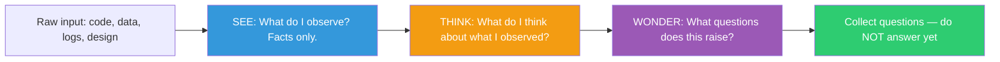

## The Move

Three phases, done strictly in order with no bleeding between them. **SEE (3 minutes):** Write down only what you observe. Facts. No interpretation. "The response time graph shows a spike at 2:14 PM." NOT "The server was overloaded at 2:14 PM." **THINK (3 minutes):** Now interpret. What do your observations suggest? "The spike coincides with the daily cron job. It might be resource contention." **WONDER (3 minutes):** What questions do your interpretations raise? "Does the cron job run on the same host? What happens if we move it to off-peak hours? Are there other daily patterns we haven't noticed?" Do not answer the Wonder questions yet. Collect them.

## When to Use

- You're about to diagnose a production incident and need to avoid premature conclusions
- You're reviewing unfamiliar code and want to understand before judging
- The team is arguing about interpretations of the same data
- You're starting a new project and need to survey the landscape before committing to a direction

## Diagram

## Example

**Situation:** You inherit a microservice from a team that left the company. No documentation. You need to understand it before making changes.

**SEE (facts only):**
- The service has 47 API endpoints
- 31 of those endpoints have no test coverage
- The database has 12 tables; 4 of them have no foreign key constraints
- The Dockerfile pins to a base image from 2023
- There are 6 environment variables referencing services that no longer exist in the infrastructure registry
- The deploy pipeline has been green for 11 months (no deploys in 11 months)

**THINK (interpretation):**
- 31 untested endpoints suggest the original team stopped writing tests at some point — perhaps after a deadline push
- The 4 unconstrained tables may be append-only event logs (common pattern for tables without FK constraints)
- 6 dead service references mean this service has orphaned integrations that probably fail silently
- No deploys in 11 months means it's either rock-solid or abandoned

**WONDER (questions):**
- Which of the 31 untested endpoints are actually called in production? (Some might be dead code)
- Are the 4 unconstrained tables actually event logs, or just poorly modeled?
- Do the 6 dead service references cause silent failures or are they behind feature flags?
- Why did deploys stop? Fear? Stability? Team departure?

**Result:** Without See/Think/Wonder, you would have likely jumped from "47 endpoints, no tests" straight to "this is a mess, let's rewrite it." The structured observation reveals that the service might be mostly dead code with a small, stable core — a very different conclusion.

## Watch Out For

- The hardest discipline is keeping See free of interpretation. "The code is messy" is a Think, not a See. "The average function is 200 lines with 4 levels of nesting" is a See. Practice the distinction
- Think is not a license to speculate wildly. Each Think should connect to a specific See. "The spike coincides with the cron job" connects to an observation. "The system was probably hacked" does not
- Wonder is the most valuable phase and the one most people rush through. The quality of your questions determines the quality of your next steps. Spend the full 3 minutes
- This move is especially powerful in group settings where people have different observations. Have each person do See independently, then share before moving to Think
