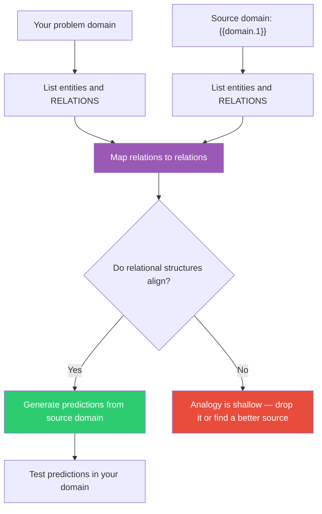

## The Move

Gentner showed that deep analogies preserve RELATIONS between elements, not the elements themselves. When drawing an analogy to **{{domain.1}}**, follow this procedure: (1) List the key entities in your problem and their relationships. (2) List the key entities in the source domain and THEIR relationships. (3) Map relationships to relationships, ignoring surface features. (4) Check: does the relational structure actually hold? If you are only mapping nouns to nouns ("our codebase is like a garden because code is like plants"), your analogy is shallow and will mislead. If you are mapping relationships ("the relationship between soil health and plant growth parallels the relationship between code quality and feature velocity"), you have a structural analogy that can generate real predictions.

## When to Use

- You are using a metaphor to guide a design decision and want to verify it holds
- You need to explain a complex system to someone using a familiar domain
- You are borrowing a pattern from another field and need to know what actually transfers
- An analogy is generating debate and you want to test it rigorously

## Diagram

## Example

**Problem:** "We need to decide how to structure our microservices team ownership."

**Source domain ({{domain.1}}, e.g., urban planning):**

**Shallow analogy (noun mapping):** "Services are like buildings. Teams are like tenants." This tells you nothing actionable.

**Deep analogy (relation mapping):**

| Your domain (relation) | Urban planning (relation) |
|------------------------|--------------------------|
| Service A depends on Service B's API | Building A depends on Building B's utility infrastructure |
| When team B changes their API, team A breaks | When the utility company changes pipe routing, building A loses water |
| Shared databases create hidden coupling | Shared utility corridors create hidden dependencies between buildings |

**Structural insight from source:** In urban planning, the solution to utility dependency is standardized interfaces at the property line — water mains, electrical panels, sewer connections. Each building connects through a well-defined boundary, and the internal plumbing is the owner's problem. **Prediction:** Define a standardized "service boundary" contract (API schema, SLA, event format) and let each team own everything behind that boundary. This is not a new idea (it is basically API contracts), but the analogy predicts something specific: invest heavily in the BOUNDARY specification, not in coordinating internal implementations.

**Test the prediction:** Does heavy investment in API contract tooling (schema validation, contract testing, SLA monitoring) actually reduce cross-team coordination overhead? That is a testable hypothesis the analogy generated.

## Watch Out For

- Surface analogies are seductive because they are easy. "Our startup is like a pirate ship" feels motivating but generates zero actionable predictions. Demand relational depth or drop the analogy
- Even deep analogies eventually break down. Every analogy has a boundary beyond which the mapping fails. Find that boundary explicitly — it tells you where the analogy stops being useful
- Analogies generate hypotheses, not conclusions. The structural mapping suggests what might be true. You still need to verify it in your actual domain
- Beware of analogies that feel deep because the source domain is prestigious (military strategy, physics). Prestige is not structural alignment
