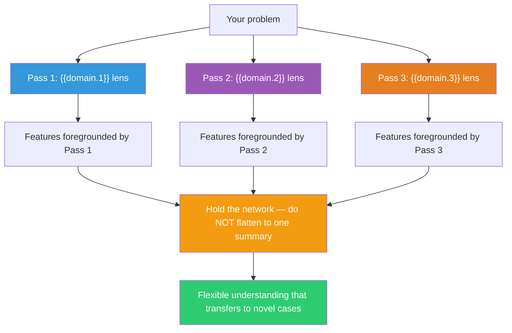

## The Move

Spiro's research shows that for complex, ill-structured domains, learning from a single pass through the material — no matter how thorough — produces brittle understanding that fails on novel cases. Instead, you must CRISS-CROSS the same landscape multiple times from different conceptual angles. Take your problem and approach it three times: first through the lens of **{{domain.1}}**, then **{{domain.2}}**, then **{{domain.3}}**. Each pass through the same territory will foreground different features and background others. After all three passes, do NOT try to synthesize into a single summary. Instead, hold the network of perspectives — the understanding that transfers to novel situations is the one that preserves multiple viewpoints simultaneously.

## When to Use

- The problem is ill-structured and resists a single clean framework
- Your current understanding breaks down on edge cases or novel scenarios
- You need flexible understanding that transfers, not rigid rules
- You are building expertise in a complex domain, not just solving one instance

## Diagram

## Example

**Problem:** "How should we design the permissions system for our multi-tenant SaaS platform?"

**Pass 1 — {{domain.1}} lens (e.g., political science):** Through the lens of governance, the permissions system is a constitution. It defines who has power, how power is delegated, and what checks exist. This foregrounds: separation of powers (admin vs. user vs. auditor roles), delegation chains (can an admin grant sub-admin rights?), and amendment procedures (how do permission rules change over time?). Feature foregrounded: the CHANGE PROCESS for permissions matters as much as the initial design.

**Pass 2 — {{domain.2}} lens (e.g., ecology):** Through the lens of ecosystems, permissions are like ecological niches — they define what each actor can access and consume. This foregrounds: competition for shared resources (rate limits, storage quotas), symbiotic relationships (a reporting service needs read access to billing data), and invasive species (a compromised service account that escalates privileges). Feature foregrounded: permissions are not just about authorization — they shape RESOURCE CONSUMPTION patterns.

**Pass 3 — {{domain.3}} lens (e.g., architecture):** Through the lens of building architecture, permissions are like physical access control — doors, keys, security zones. This foregrounds: the principle of least privilege (people only have keys to rooms they need), emergency overrides (fire codes require exits even from secured areas), and the distinction between perimeter security and interior security. Feature foregrounded: you need EMERGENCY ACCESS patterns, not just normal-state permissions.

**Network result:** The permissions system needs (a) a change process for permission rules themselves (from Pass 1), (b) integration with resource quotas and rate limiting (from Pass 2), and (c) emergency override mechanisms with audit trails (from Pass 3). No single pass would have surfaced all three requirements. A linear analysis through security best practices alone would likely miss the governance and resource dimensions.

## Watch Out For

- Three passes takes real time. This is a deep-effort move. Do not attempt it when you need an answer in an hour
- The temptation after three passes is to flatten everything into a single bullet-point summary. Resist this. The value is in the NETWORK of perspectives, not a synthesis. Premature synthesis loses the flexibility
- Not every problem is ill-structured. Well-structured problems (sorting algorithms, SQL queries) have single correct frameworks. Save criss-crossing for genuinely complex, ambiguous domains
- The domains should be genuinely different, not three variations of the same field. Maximum cognitive distance between lenses produces maximum insight
