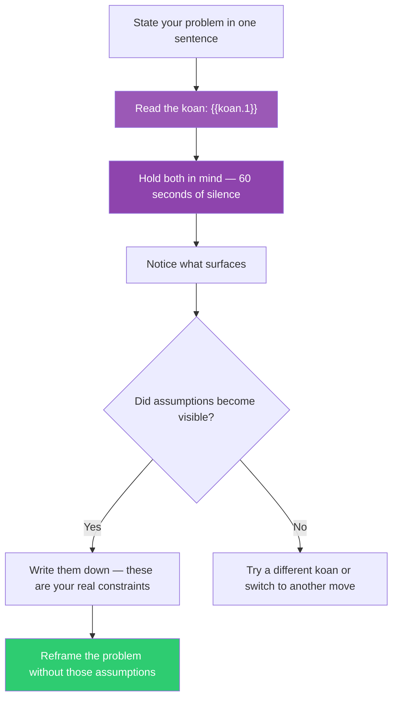

## The Move

Write your problem in one sentence. Now read this koan: **{{koan.1}}**. Do not try to answer the koan or connect it to your problem. Instead, hold both in mind simultaneously — the problem and the koan, side by side — for at least 60 seconds of silence. Notice what happens. What assumptions about your problem become visible when you hold them next to an unanswerable question? Write down whatever surfaces, especially if it doesn't make logical sense yet.

The koan works by disrupting analytical machinery. When analysis has failed, that disruption is precisely what you need. The koan does not give you a new answer — it dissolves the frame that made the old answers seem like the only options.

## When to Use

- Your rational analysis keeps producing the same conclusions
- You feel like the problem has a hidden dimension you can't name
- You've exhausted conventional brainstorming techniques
- The problem feels paradoxical or self-contradictory
- You're willing to spend 5 minutes on something that feels unproductive

## Diagram

## Example

**Problem:** "Our microservices architecture has become so complex that no single engineer understands the full request lifecycle. We keep adding observability tooling but it makes the system more complex."

**Koan:** *When you can do nothing, what can you do?*

**Sitting with both:** The engineer holds the complexity problem alongside the koan. After a minute, something surfaces: "We keep trying to make the complex system understandable. The koan asks what happens when you accept you can't do the thing you're trying to do. What if we accepted that no one will ever understand the full system — and designed for that reality instead of fighting it?"

**What shifted:** The assumption "we need someone to understand the full system" was invisible until the koan illuminated it. The new direction: instead of better observability (making complexity visible), build the system so that each engineer only NEEDS to understand their local context. Ownership boundaries, not dashboards.

## Watch Out For

- This is not mysticism for its own sake. If nothing surfaces after 2-3 minutes, move on. The koan is a tool, not a religion
- Don't force a connection between the koan and your problem. If you're "explaining how the koan relates," you've switched back to analytical mode. The connection should arrive, not be constructed
- The insight may not come during the exercise. It may surface 20 minutes later while you're doing something else. Write down the koan and your problem — prime the pump, then let go
- Avoid treating this as a parlor trick. The value comes from genuine stillness, not from performing contemplation
