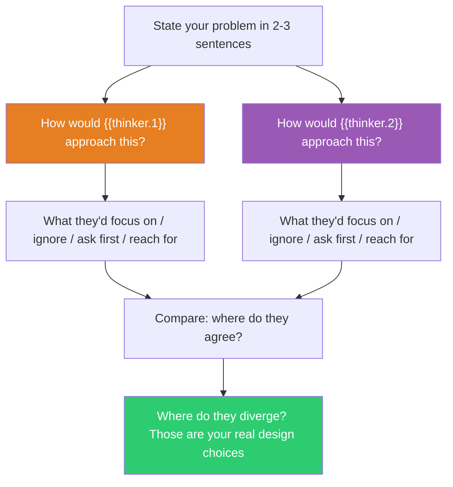

## The Move

State your problem in 2-3 sentences. Now ask: "How would **{{thinker.1}}** approach this?" Be specific — what would they focus on first? What would they ignore entirely? What question would they ask before doing anything? What tool or method would they reach for? Write their approach in 3-4 sentences. Then do the same for **{{thinker.2}}** — chosen to be a deliberately different kind of mind. Compare the two approaches: what do they agree on (that's probably important) and where do they diverge (that's where your real design choices live)?

## When to Use

- You keep circling back to the same solution shaped by your own defaults
- The problem requires a kind of thinking you sense exists but can't access
- You want to widen the solution space before committing to a direction
- You're working solo and need to break out of a single reasoning style

## Diagram

## Example

**Problem:** "Our CI pipeline takes 45 minutes. Developers context-switch while waiting. We've already parallelized tests and added caching."

**{{thinker.1}} — Sherlock Holmes:** "The obvious suspects have been eliminated — parallelization, caching. So the problem isn't where you're looking. I'd instrument the pipeline with microsecond granularity and look for the dog that didn't bark — what step is NOT slow but is triggering something that IS? The idle gaps between stages, the network round-trips to artifact storage, the Docker layer rebuilds that happen silently. The crime isn't in the tests. It's in the transitions."

**{{thinker.2}} — Jeff Bezos:** "45 minutes is the wrong metric. The real metric is: how many deploy cycles per developer per day? Maybe the answer isn't a faster pipeline — it's eliminating the need to wait. Ship to a preview environment in 3 minutes with a subset of critical tests, run the full suite asynchronously, and let developers keep working. Optimize for throughput, not latency."

**Comparison:** Holmes says investigate the hidden bottleneck. Bezos says change the workflow so the bottleneck doesn't matter. They agree the current framing ("make tests faster") is exhausted. The real choice: invest in deeper diagnosis or restructure the deployment model entirely.

## Watch Out For

- Be SPECIFIC about what the thinker would do. "Feynman would think deeply" is useless. "Feynman would draw a diagram, simplify to the two-particle case, and ask what happens at the boundary" is useful
- Fictional characters often work better than real people because their thinking style is more concentrated and distinctive — Sherlock Holmes has a clearer methodology than most real detectives
- Choose thinkers who are genuinely different from each other. Two scientists will produce similar angles; a scientist and a filmmaker will not
- The value isn't in roleplaying — it's in activating a well-defined reasoning style that differs from your default mode
