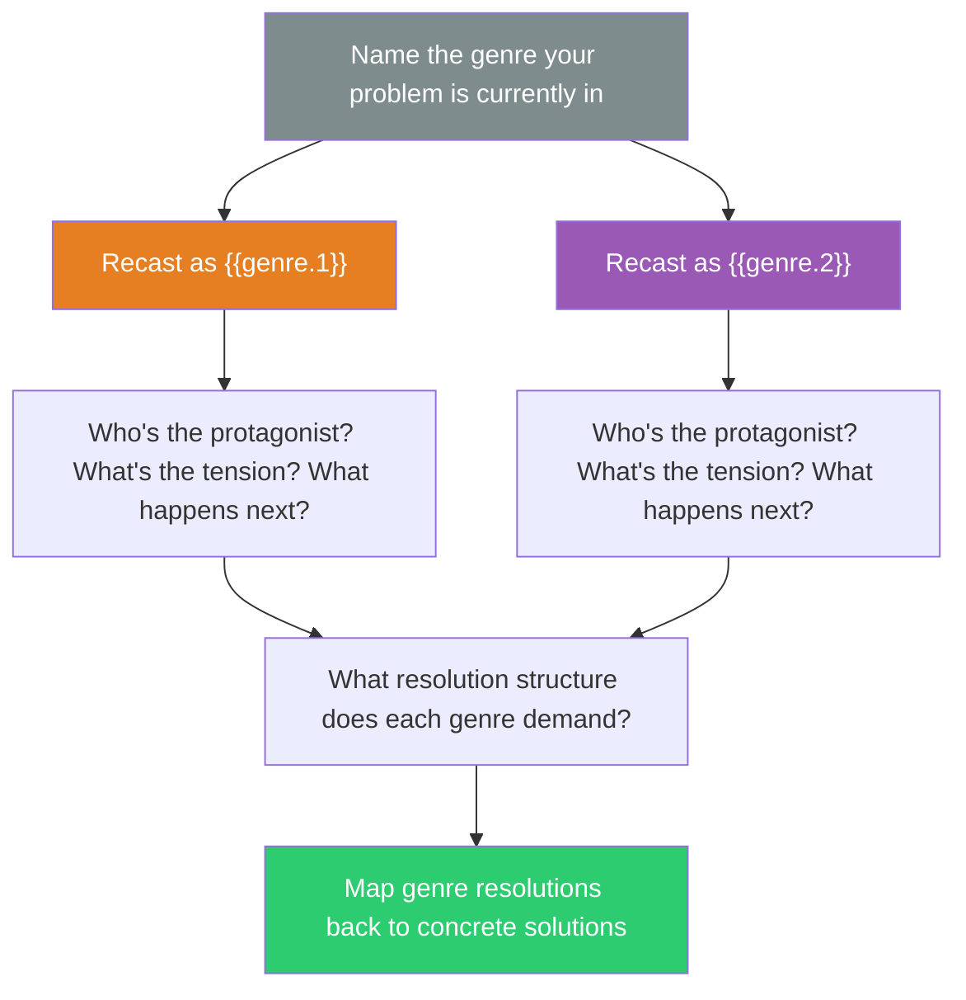

## The Move

First, name the genre your problem is currently living in. (Most technical problems default to "engineering report" or "business case.") Now recast the entire situation as **{{genre.1}}**. Who is the protagonist? What is the central tension? What does the genre's structure demand happens next — a twist, a reveal, a reversal, a climax? Write a 3-4 sentence version of your problem in that genre. Then recast it again as **{{genre.2}}**. Different genres have different resolution structures: a mystery needs a hidden truth revealed, a heist needs a team with complementary skills, a comedy needs a reversal of expectations. The genre's expected resolution suggests a solution shape your problem's native genre doesn't.

## When to Use

- The problem statement has calcified into one way of telling the story
- You need to see the human/political/emotional dynamics that technical framing hides
- Stakeholders are bored or disengaged with the current framing
- You want to discover what kind of resolution this problem actually needs

## Diagram

## Example

**Problem:** "Our payment processing system has intermittent failures that nobody can reproduce. Three teams have investigated. Each blames a different upstream dependency."

**Current genre:** Detective procedural / blame game.

**Recast as mystery:** "Something is stealing transactions in the night. Three witnesses point in different directions. In a mystery, the resolution is always: the clues that DON'T fit the obvious suspects are the real clues. What evidence have all three teams dismissed because it didn't fit THEIR theory? There's a hidden actor — a cron job, a race condition, a DNS cache — that no team owns, which is why no team found it."

**Recast as heist:** "The system needs to move a payment from point A to point B through hostile territory (unreliable networks, concurrent requests, stale caches). In a heist, every team member has a specialty. The failure happens when two specialists' domains overlap and neither covers the gap. Map the handoff points. The bug lives in a seam between teams, not inside any team's domain."

**What shifted:** The mystery framing says "look at what's been dismissed." The heist framing says "look at the seams between specialists." Both point away from deeper investigation within each team and toward the gaps between them. Concrete next step: audit the inter-service boundaries that no single team owns.

## Watch Out For

- The genre is a thinking tool, not a presentation format. You don't need to write an actual mystery — you need the mystery's STRUCTURE to suggest where to look
- Some genres will feel forced for your problem. That's useful information — it means your problem has a strong implicit genre that's worth naming
- Don't stop at "this is funny." Push to: "what resolution does this genre demand, and what does that suggest I should actually do?"
- The most productive genre shifts are usually the most surprising ones. If the genre feels like a natural fit, it probably won't reveal much
