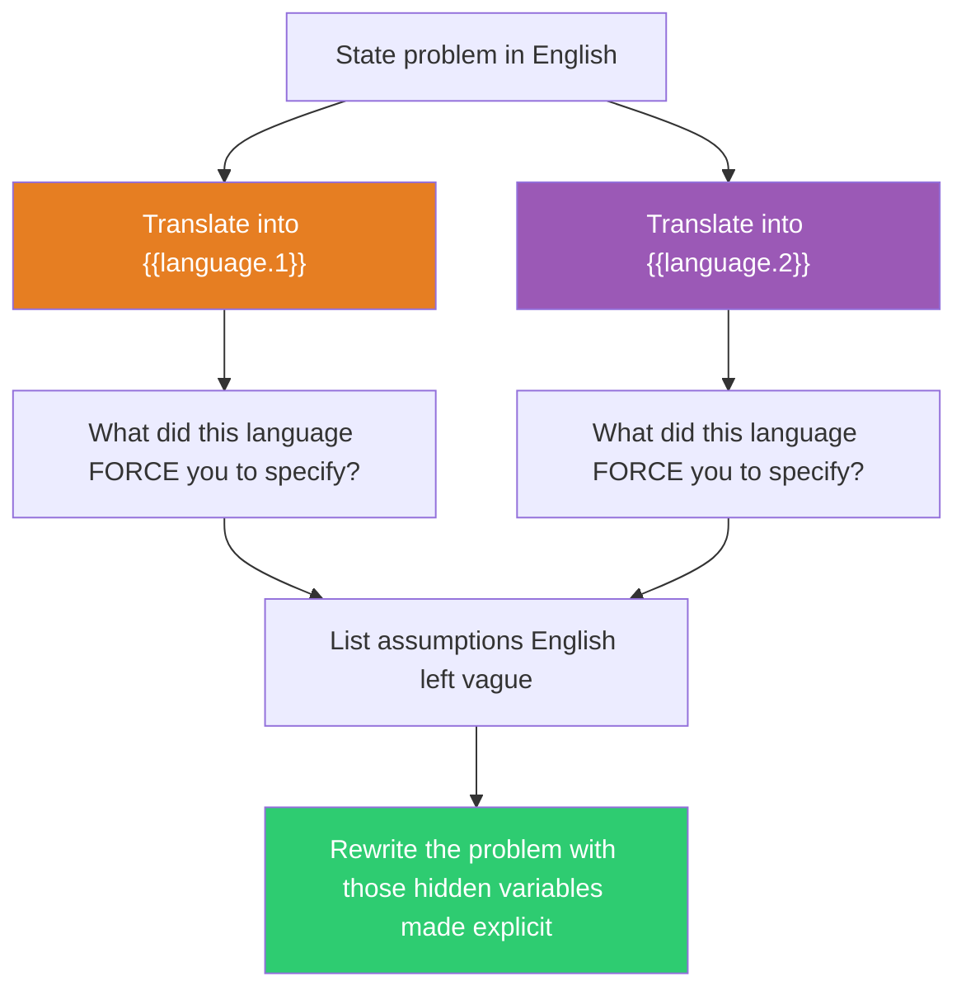

## The Move

Write your problem in one clear sentence in English. Now restate it in **{{language.1}}** — not word-for-word translation, but express the concept using that language's native structures, idioms, and grammar. What does the language force you to specify that English left vague? What distinctions does it make that English doesn't? What compound words or dedicated concepts does it have for things English needs a whole phrase to say? Write down what you noticed. Then do the same for **{{language.2}}**. Each language is a different operating system for thought — it makes certain distinctions mandatory and others invisible. The structural constraints of a foreign grammar reveal assumptions your native framing smuggled in.

## When to Use

- Your problem statement has become a frozen phrase everyone repeats without examining
- You suspect the English framing is baking in assumptions about agency, time, or causation
- You need a structured way to see what you're leaving vague or implicit
- You work in an international team and want to surface cultural-linguistic blind spots

## Diagram

## Example

**Problem (English):** "The service is slow."

**In Turkish:** Turkish has evidentiality markers — you must grammatically indicate whether you witnessed something directly or heard about it secondhand. "The service is slow" becomes either "The service is slow (I observed this myself)" or "The service is slow (reportedly)." Forced question: do we actually HAVE latency data, or are we repeating a complaint? Who measured this, and how?

**In Spanish:** Spanish has two verbs for "to be" — *ser* (inherent nature) and *estar* (current state). "The service IS slow" splits into: "The service is INHERENTLY slow" (*el servicio es lento*) vs. "The service is CURRENTLY slow" (*el servicio esta lento*). Forced question: is this a design problem (the architecture is fundamentally slow) or a state problem (something is wrong right now)?

**What surfaced:** The English sentence hides two critical variables: (1) the evidence basis (observed vs. reported) and (2) whether "slow" is a trait or a state. These are different problems with different solutions. A trait-slow service needs a redesign. A state-slow service needs diagnosis. A reportedly-slow service might not be slow at all.

## Watch Out For

- You don't need to be fluent. Even rough knowledge of a language's structural features is enough — the value is in the QUESTIONS the grammar forces, not in producing correct sentences
- If you're working with an AI, ask it what the target language forces you to specify. The AI has deep knowledge of linguistic structures
- Some translations will be trivially similar to English. That's uninformative — pick languages that are structurally distant from English for maximum insight
- The goal is not to produce a foreign-language problem statement. The goal is to discover what English was hiding
