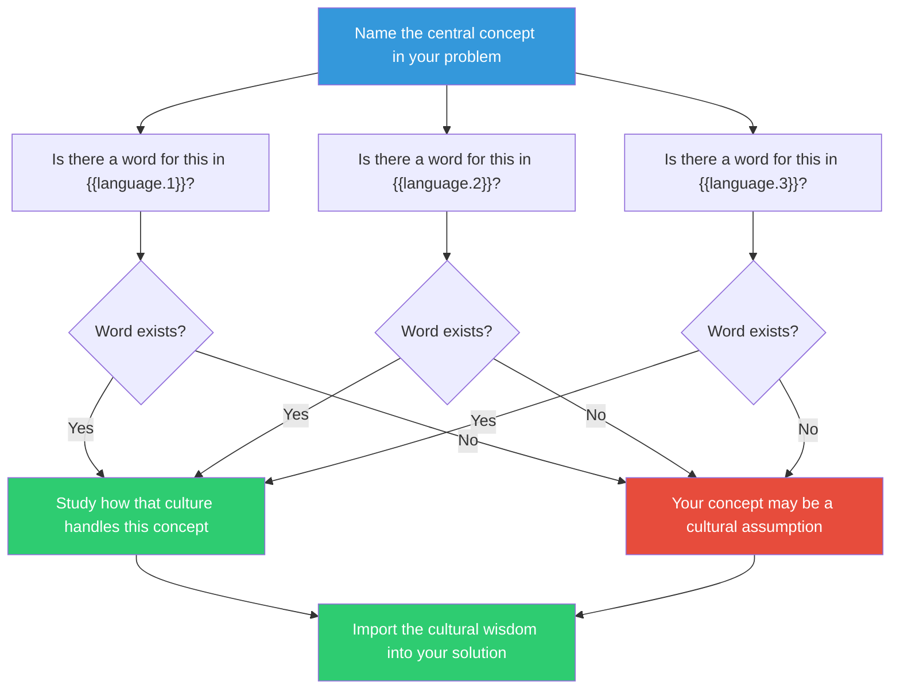

## The Move

Identify the central concept, feeling, or dynamic in your problem — the thing you keep circling around but can't quite pin down. Now ask: is there a single word for this in **{{language.1}}**? In **{{language.2}}**? In **{{language.3}}**? If a language HAS a dedicated word, that concept is culturally recognized and well-understood — look at how that culture handles it. If a language has NO word for it, the concept may be invisible in that worldview, which means YOUR concept might be a cultural assumption rather than a universal truth. Untranslatable words (saudade, wabi-sabi, schadenfreude, ubuntu, hygge) are condensed cultural wisdom. Find the one that fits your problem and use it as a lens.

## When to Use

- You can describe your problem but can't name the core dynamic in one word
- Different people on the team use different words for what seems like the same thing
- You suspect the problem is shaped by cultural assumptions about work, time, quality, or relationships
- You want to discover whether your core concept is universal or culturally specific

## Diagram

## Example

**Problem:** "Our engineering team ships fast but the codebase feels increasingly fragile. It's not technical debt exactly — it's more like the system works but nobody feels confident touching it. There's a pervasive unease."

**Central concept:** The feeling that something works but is subtly wrong and could break at any moment.

**Japanese — wabi-sabi:** No, that's beauty in imperfection. But related concept: *kintsugi* (repairing with gold, making the break visible). The codebase's fractures could be made visible and honored rather than hidden.

**German — Verschlimmbesserung:** Yes. An "improvement" that makes things worse. Each sprint "improves" the code but degrades overall coherence. The word names the dynamic precisely: the problem IS the improvement process itself.

**Danish — hygge:** No word for engineering unease. But the absence is revealing — hygge cultures value coziness and safety. What would a "hygge" codebase feel like? One where developers feel safe and comfortable making changes. That's the opposite of the current state and names the goal.

**What shifted:** *Verschlimmbesserung* named the dynamic: each improvement is a degradation. The solution isn't "pay down tech debt" (more improvement) — it's to stop improving for a sprint and instead build confidence: add tests, write decision records, pair on the scariest modules. Make the codebase feel safe before making it "better."

## Watch Out For

- You don't need to find a perfect one-to-one translation. The value is in the SEARCH — even approximate matches reveal something about your concept
- Untranslatable words are cultural lenses, not magic solutions. Finding the word is step one; understanding the cultural practice around it is where the insight lives
- If you're working with an AI, ask it to suggest untranslatable words from the target languages that are closest to your concept. Cast a wide net
- Be careful of "exotic word tourism" — dropping a foreign word into a meeting for novelty. The word is useful only if it changes how you THINK about the problem, not just how you TALK about it
