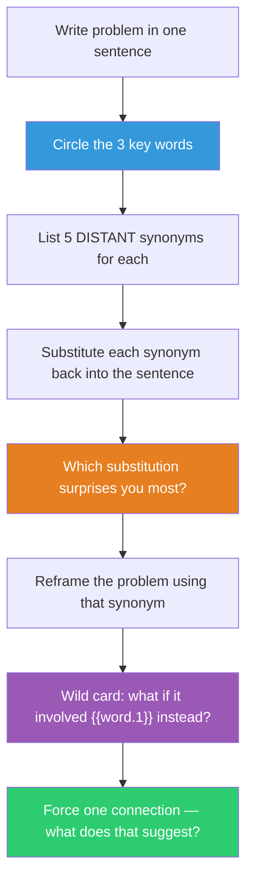

## The Move

Write your problem in one sentence. Circle the 3 most important words. For each, list 5 synonyms — not the closest ones, the most DISTANT synonyms that still technically apply. "Fast" becomes "instantaneous, responsive, premature, hasty, fleeting." "Build" becomes "assemble, cultivate, forge, accrete, fabricate." Read each distant synonym back into your problem sentence and notice which substitution surprises you. "Making the API fast" vs. "making the API responsive" vs. "making the API premature" — these are different design problems. Pick the synonym that creates the most unexpected reframe. Then, as a final perturbation: what if the problem had nothing to do with any of these words but instead involved **{{word.1}}**? Force one connection.

## When to Use

- You need a quick reframe in under 3 minutes
- The problem statement has calcified into a cliche that the team repeats reflexively
- You want to explore nearby solution spaces, not leap to a distant one
- You're looking for a small linguistic nudge that shifts the design direction

## Diagram

## Example

**Problem:** "We need to **reduce** **latency** in the **checkout** flow."

**Distant synonyms:**
- **reduce** -> diminish, compress, *starve*, amputate, dilute
- **latency** -> delay, dormancy, *incubation*, gestation, hibernation
- **checkout** -> departure, *graduation*, settlement, clearance, exit

**Surprising reframes:**
- "Starve the latency" — don't optimize it, deny it resources. What if the slow path simply didn't exist? Remove the steps instead of speeding them up.
- "Reduce the incubation" — latency as incubation suggests something is GROWING during the wait. What's being computed that could be pre-computed? The wait isn't dead time — it's a process.
- "Reduce latency in the graduation" — checkout as graduation reframes it as a milestone the user has EARNED. This suggests: make the checkout feel like a reward, not a chore. Pre-fill everything. Celebrate the purchase.

**Wild card — {{word.1}} is "drawbridge":** A drawbridge is closed by default and opens on demand. Current checkout: open by default, slows you down with verification. What if checkout were a drawbridge — pre-verified, pre-authorized, and it just OPENS when you arrive? One-click checkout for returning users, verified in the background.

**Result:** "Starve the latency" led to eliminating two redundant API calls. "Drawbridge" led to a background pre-authorization flow that cut checkout time by 60%.

## Watch Out For

- Go for the DISTANT synonyms, not the close ones. "Quick" for "fast" won't teach you anything. "Premature" for "fast" will
- Not every synonym will spark something. You need 5 per word so that at least one surprises you. It's a numbers game
- The random word ({{word.1}}) is a deliberate disruption. If the connection feels forced, good — forced connections are the point. Push through the discomfort for one minute before giving up
- This is a generation move, not an evaluation move. Capture ALL the reframes, then evaluate them separately
