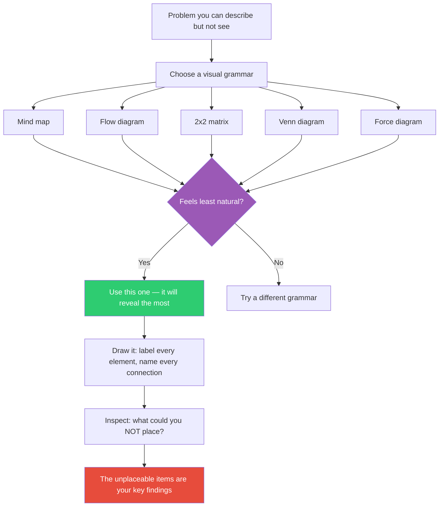

## The Move

Pick a specific visual grammar for your problem. Do not just "draw a diagram" — commit to one of these structures: **(a) Mind map** — concepts radiate from a center, showing hierarchy and association. **(b) Flow diagram** — boxes and arrows showing sequence, branching, and loops. **(c) 2x2 matrix** — two dimensions creating four quadrants that force classification. **(d) Venn diagram** — overlapping sets showing what is shared and what is unique. **(e) Force diagram** — arrows showing pushes and pulls, tensions and supports. Now: pick the grammar that feels LEAST natural for your problem. That discomfort means it will force you to commit to relationships you have been leaving vague. Draw it. Every element must be labeled. Every connection must be named. Or try drawing it in the style of {{genre.1}}. If you cannot place something, that is the finding.

## When to Use

- When a written explanation keeps growing without getting clearer
- When you can feel that parts are connected but cannot articulate how
- When a team discussion needs a shared artifact to anchor on
- When you are stuck and suspect the problem has spatial or relational structure you are missing
- When you want to find gaps — things that should be on the diagram but are not

## Diagram



## Example

**Problem:** "Our authentication system is too complex and we need to simplify it."

You instinctively reach for a flow diagram because auth is a process. Resist that. Try a **force diagram** instead — it feels wrong for auth, which is exactly why it will help.

Draw arrows representing forces acting on the auth system:

```
PUSHING TOWARD COMPLEXITY:
  --> compliance requirements (SOC2, GDPR)
  --> multiple identity providers (Google, SAML, magic link)
  --> legacy API key system still in use
  --> per-tenant custom auth rules

PUSHING TOWARD SIMPLICITY:
  --> developer onboarding speed
  --> reduced attack surface
  --> fewer support tickets
  --> faster incident response

ANCHORS (immovable):
  [=] OAuth2 standard
  [=] existing user sessions (cannot invalidate)
```

Now you can see the problem differently. The complexity is not accidental — four specific forces are pushing toward it. Simplification means weakening or removing specific forces, not just "making it simpler." The per-tenant custom auth rules arrow is the largest force, and it is the one nobody has questioned. That is your leverage point.

A flow diagram would have shown you the steps. The force diagram showed you *why the steps exist*.

## Watch Out For

- "Draw a diagram" without choosing a grammar produces a meaningless blob of boxes and lines. The grammar is what creates the thinking, not the drawing.
- If the diagram looks clean and confirms what you already knew, you picked the comfortable grammar. Switch to one that feels awkward.
- Do not over-invest in making the diagram pretty. This is a thinking tool, not a presentation. Ugly and insightful beats polished and obvious.
- A diagram is a snapshot. If the system changes over time, you may need multiple diagrams or a different grammar (e.g., a timeline or state diagram) to capture the dynamic.
- The most valuable part of the exercise is often what you cannot place on the diagram. Pay attention to the orphan concepts that do not fit the grammar — they may be the most important elements.
