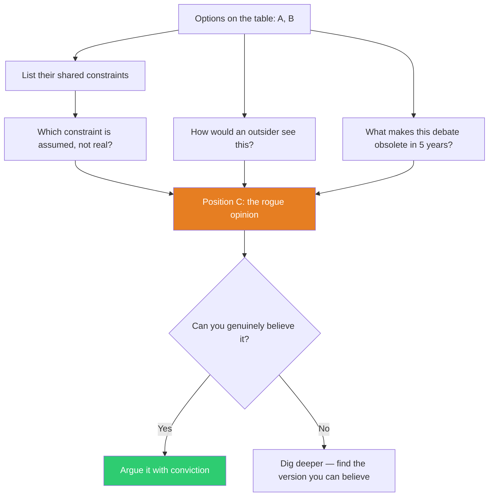

## The Move

List the positions currently on the table. Now find the position that NO ONE holds — not the opposite of A (that's B), but the one that breaks the frame entirely. Three methods:

1. **The outsider test.** How would {{thinker.1}} see this problem? Someone from {{domain.1}}? They wouldn't even recognize the A-vs-B framing — what would they propose instead?

2. **The constraint audit.** List every constraint the current options share. At least one of those constraints is assumed, not real. Remove it. What option becomes possible?

3. **The time traveler.** Someone from five years in the future looks at this debate and laughs. What do they know that you don't? What made the A-vs-B framing obsolete?

The rogue opinion must be GENUINELY held — argued with conviction, not performed as devil's advocacy. Nemeth's research shows that authentic minority dissent improves group thinking; assigned devil's advocacy does not. The difference is belief. If you can't believe it, dig deeper until you find the version you can.

For agents: spawn a subagent with explicit instructions to ignore the current debate framing entirely. Feed it only the goal and constraints, not the existing options. See what it proposes independently.

## When to Use

- A decision has polarized into two camps and the middle ground is just a worse version of both
- Devil's advocacy was tried and produced nothing — because it was theater, not genuine dissent
- The options on the table were all generated in the first five minutes of discussion
- You suspect the problem is mis-framed but can't articulate how
- A group is about to vote between options and you want to stress-test the option set itself

## Diagram

## Example

**The debate:** "Should we build our own analytics pipeline (A) or use a vendor like Amplitude (B)?"

**Shared constraints both options assume:**
- We need an analytics pipeline
- We need to track user behavior at the event level
- We need dashboards that product managers look at

**The rogue opinion (C):** "We don't need an analytics pipeline at all. We have 200 users. The founder talks to 10 of them every week. The dashboards nobody looks at cost us $2,000/month and two weeks of engineering time per quarter. Replace the entire analytics stack with a weekly 15-minute call rotation where every engineer talks to one user. When we hit 2,000 users, revisit."

**Why it's genuine, not performative:** At 200 users, statistical analysis of event data is numerically meaningless — the sample sizes are too small for reliable patterns. Direct user conversations produce higher-fidelity signal at this scale. The A-vs-B debate assumed analytics was necessary; the rogue opinion questioned the frame.

## Watch Out For

- Contrarianism for its own sake is not a rogue opinion — it's noise. The rogue opinion must solve the original goal, just from a frame nobody considered
- If the rogue opinion is immediately dismissed, pay attention to WHY. "That's impractical" often means "that violates a constraint I haven't examined." Push on the dismissal
- The rogue opinion will often feel uncomfortable or slightly embarrassing to propose. That's a positive signal — comfortable opinions are already on the table
- This move is most valuable when it DOESN'T win. Even a rejected rogue opinion expands the group's understanding of the decision space and often improves whichever option does win
