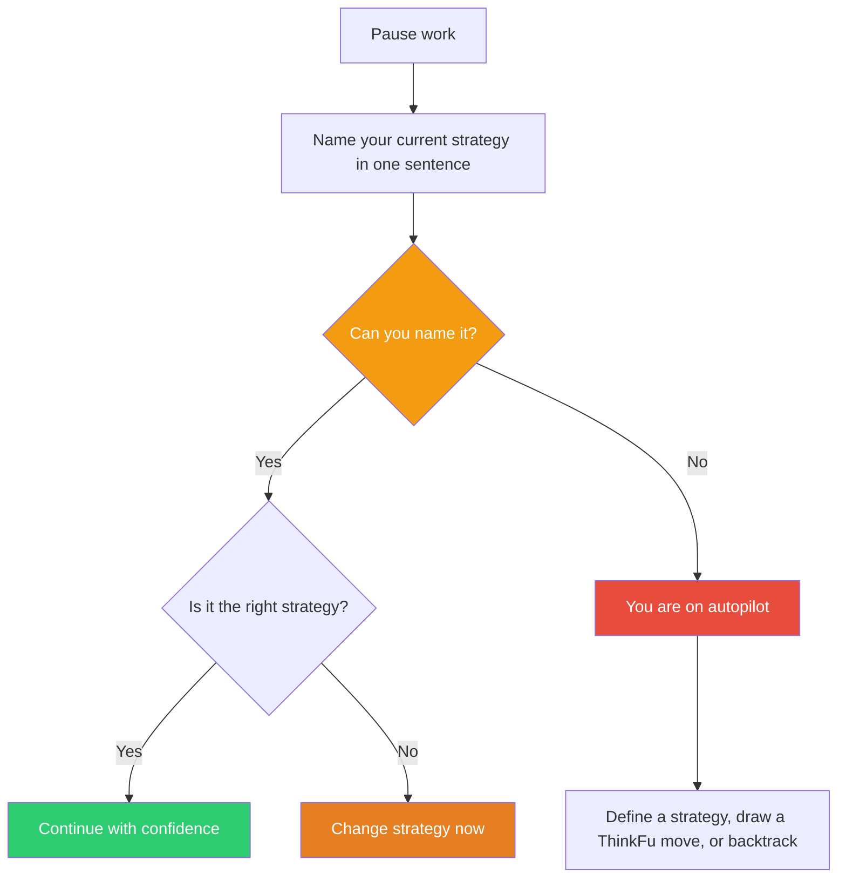

## The Move

Stop. Name it in exactly {{word_limit}} words. Name the strategy you are currently using to solve this problem.

Not what you're *doing* ("writing code", "researching options") — what you're *strategically doing* ("narrowing the solution space by testing edge cases first", "building a minimal prototype to validate the core assumption", "pattern-matching against similar problems I've seen before").

If you can't name it, you don't have a strategy. You're executing on momentum. That's sometimes fine — but you should be choosing it, not defaulting to it.

## When to Use

- At any point during work — this move is a universal interrupt
- When you realize you've been "heads down" for a while without checking direction
- When someone asks "why are you doing it that way?" and you don't have a crisp answer
- As a periodic check-in: every 15 minutes of focused work, or at natural breakpoints

## Diagram

## Example

**Situation:** You're 30 minutes into refactoring a module. You've renamed some variables, extracted a helper function, and are now considering splitting a class.

**The check:** "What's my strategy here?"

- **Can't name it?** You started with a small rename and scope-crept into a full refactor. You're on autopilot. Stop and decide: is a full refactor what you actually want to do right now?
- **"I'm improving readability by reducing cognitive load in the hot path."** Good — that's a real strategy. Now ask: is this the right strategy given the time you have?
- **"I'm refactoring because the code is messy."** That's a *motivation*, not a strategy. What specifically are you trying to achieve and how will you know you're done?

## Watch Out For

- Naming your strategy doesn't mean it's the right one — it just means you're conscious of it. Follow up with "is this the right strategy?" not just "do I have one?"
- This move can feel trivially simple. That's the point. The value isn't in the complexity of the technique — it's in the interrupt itself. Most bad decisions happen on autopilot
- Don't over-formalize. The answer can be casual ("I'm basically just trying things until something works") — the value is in *noticing*, not in having a grand plan
