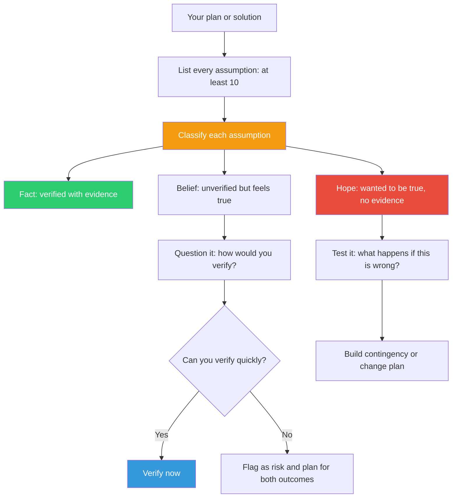

## The Move

List **every assumption** you are currently making — about the user, the system, the constraints, the data, the timeline, the team, the environment. Write them all down. Aim for at least 10. Dig past the obvious ones into the assumptions so basic you've never stated them.

Now classify each one into three buckets:

- **Fact** — verified with evidence. You have data, documentation, or direct observation.
- **Belief** — seems true, feels true, but you haven't verified it. Based on experience, pattern-matching, or someone else's word.
- **Hope** — you want this to be true because your solution depends on it. No evidence either way.

Question every belief. Test every hope. The hopes are where your plan is most fragile. Which assumptions would {{persona.1}} challenge first?

## When to Use

- Before committing to a plan — surface what you're betting on
- When a plan that "should work" keeps not working — a hidden assumption is probably wrong
- When inheriting a project or codebase and relying on prior decisions you didn't make
- When you feel confident but can't explain *why* you're confident

## Diagram

## Example

**Solution:** Migrating a monolith to microservices over six months.

**Assumption map:**

| # | Assumption | Classification |
|---|-----------|---------------|
| 1 | The current database schema is documented | Belief |
| 2 | The team has experience with Kubernetes | Hope |
| 3 | Latency requirements allow network calls between services | Belief |
| 4 | The monolith has clear module boundaries | Hope |
| 5 | Management will sustain funding for 6 months | Hope |
| 6 | We can deploy services independently | Belief |
| 7 | The test suite covers critical paths | Belief |
| 8 | Users won't notice the migration | Hope |

Four hopes. That means the plan has four points where it could collapse from wishful thinking alone. The Kubernetes hope (#2) is testable this week — run a skills assessment. The module boundaries hope (#4) is testable today — try to draw the dependency graph. The funding hope (#5) isn't testable but should be escalated as a risk.

## Watch Out For

- The hardest assumptions to find are the ones so fundamental you've never stated them ("users have internet access", "the API returns valid JSON", "the team stays intact"). Push past the obvious.
- Classification requires honesty. The temptation is to label hopes as beliefs and beliefs as facts. Be ruthless.
- This move produces a list, not a solution. The value is in what you *do* with the list — verify, test, or plan for failure.
- Don't treat "fact" as permanent. Facts can become stale. Re-check assumptions when conditions change.
