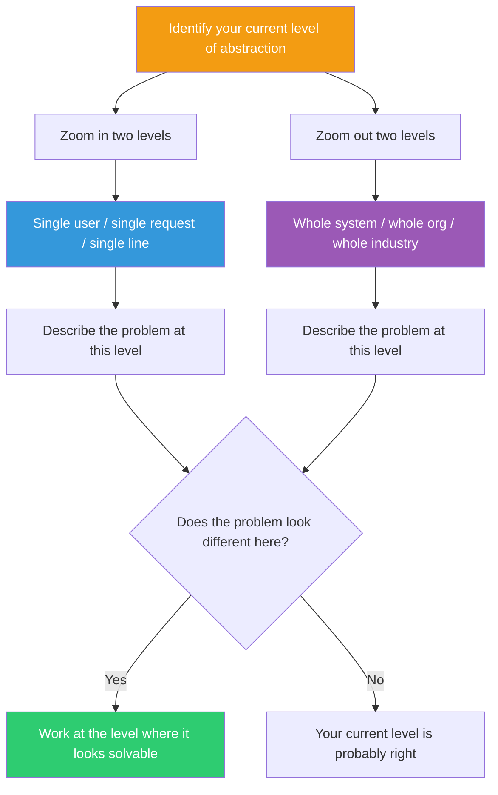

## The Move

Name the level of abstraction you are currently working at. Zoom {{levels}} levels in, then {{levels}} levels out.

**Zoom in** — What does this problem look like at the level of a single user? A single request? A single line of code? A single moment in time? Get concrete. Touch the atoms.

**Zoom out** — What does this problem look like at the level of the whole system? The whole organization? The whole industry? A ten-year time horizon? Get expansive. See the forces.

Write one sentence describing the problem at each level. The solution often lives at a different level than the one you're currently working at.

## When to Use

- You're stuck and everything you try feels wrong — you might be at the wrong altitude
- Your solution is technically sound but doesn't feel meaningful — zoom out
- Your vision is grand but you can't make progress — zoom in
- You're in a debate where people seem to be talking past each other — they're at different zoom levels

## Diagram

## Example

**Problem:** "Our deployment pipeline is too slow."

**Current level:** Infrastructure — optimizing build steps, parallelizing tests, caching Docker layers.

**Zoom in (single deploy):** One developer pushes a one-line CSS fix. It takes 45 minutes to reach production. She watches the pipeline, switches context, loses flow, and forgets what she was working on. The problem isn't speed — it's *context destruction*.

**Zoom out (whole org):** The company deploys 8 times a day across 12 teams. Each deploy blocks a shared staging environment for 45 minutes. Teams queue up. The problem isn't pipeline speed — it's *shared resource contention*.

**What shifts:** At the zoomed-in level, the solution is instant deploy for trivial changes (skip tests for CSS-only diffs). At the zoomed-out level, the solution is eliminating the shared staging environment entirely (per-team preview environments). Neither solution is "make the pipeline faster." The answer depended on the level.

## Watch Out For

- Zooming out too far produces platitudes ("it's really a people problem"). Stay concrete even at high altitude.
- Zooming in too far produces premature optimization ("this loop runs in O(n^2)"). Make sure the detail matters.
- The best use of this move is to discover which level the *real constraint* lives at. The solution level should match the constraint level.
- If you're in a group, explicitly name zoom levels. Half of all unproductive debates are two people arguing at different altitudes.
