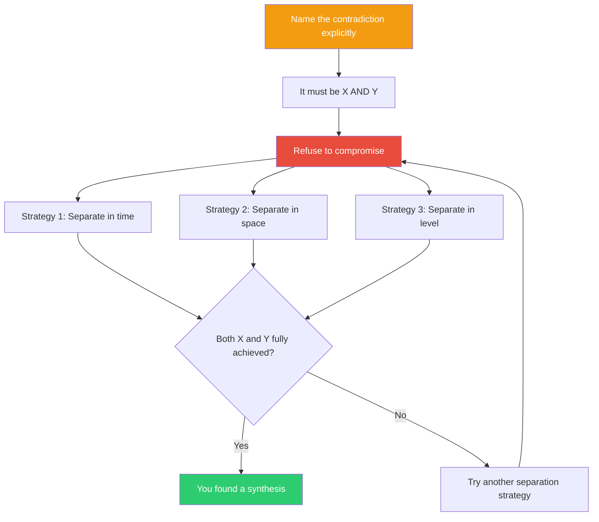

## The Move

Name the contradiction explicitly: **"It must be X AND Y, but X and Y seem to conflict."** Write it down as a sentence with "AND" in bold.

Now refuse to compromise. A compromise gives you half of X and half of Y — nobody's happy. Instead, ask: **under what conditions could both be fully true simultaneously?**

Three strategies to try: (1) **Separate in time** — can it be X first and Y later, or Y on weekdays and X on weekends? (2) **Separate in space** — can one part of the system be X while another part is Y? (3) **Separate in level** — can it be X at one level of abstraction and Y at another?

## When to Use

- Two stakeholders want opposite things and you're stuck in the middle
- You've been going back and forth between two approaches and can't commit
- The requirements document contains a hidden contradiction nobody has named
- You're about to compromise and it feels like losing twice

## Diagram

## Example

**Contradiction:** "The API must be **simple for beginners AND powerful for experts**."

**Compromise (avoid this):** A medium-complexity API that frustrates beginners and bores experts.

**Separation in space:** Simple SDK wrapper for beginners, raw API for experts. Two interfaces, one system. Both are fully served.

**Separation in level:** The surface API is simple (five methods, sensible defaults). The configuration layer underneath is powerful (every parameter exposed, composable middleware). Beginners never see the configuration layer. Experts live there.

**Separation in time:** Onboarding flow is radically simple (one function, one concept). After the user hits their first limitation, the system progressively reveals power features. Simple first, powerful later.

Each of these is better than a compromise. The contradiction wasn't real — it was a failure to separate the dimensions.

## Watch Out For

- The hardest step is naming the contradiction. Most contradictions hide in vague requirements. "It should be intuitive" — *and what else?* Force the AND.
- Not every contradiction dissolves. Some are genuinely zero-sum (budget, time). Recognize when you're facing a real tradeoff vs. a false dilemma.
- "Separate in time" is the most commonly overlooked strategy. Many X-vs-Y problems vanish when you ask "can it be X now and Y later?"
- Don't confuse synthesis with complexity. The best solutions to contradictions are often simpler than either original option.
