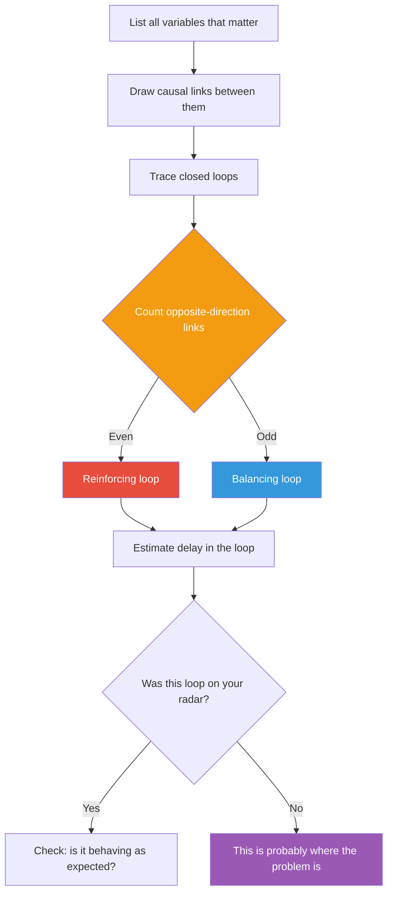

## The Move

List every feedback loop in your system. For each loop, draw the chain: A affects B, B affects C, C affects A. Label each link as same-direction (more A leads to more B) or opposite-direction (more A leads to less B). Count the opposite-direction links — an even number means the loop is reinforcing (amplifying), an odd number means it's balancing (stabilizing). For each loop, estimate the delay — how long before a change completes the circuit. Write down which loops you discovered that you hadn't been thinking about. Those are where your problems live.

## When to Use

- A system is behaving in ways nobody intended or predicted
- You fixed a problem and it came back, or the fix caused a new problem elsewhere
- Growth is accelerating or decelerating and you don't understand why
- You keep overshooting targets — over-hiring, over-provisioning, over-correcting
- Two teams are working at cross purposes and neither understands why

## Diagram

## Example

**Problem:** "Our deployment frequency has been dropping even though we hired more engineers."

**Feedback loop audit:**

- **Loop 1 (reinforcing, intended):** More engineers leads to more features leads to more users leads to more revenue leads to more hiring. This loop is working.
- **Loop 2 (reinforcing, unnoticed):** More engineers leads to more code leads to more merge conflicts leads to longer review cycles leads to larger batches leads to more merge conflicts. This is a vicious cycle — the thing meant to speed you up is slowing you down.
- **Loop 3 (balancing, long delay):** Slower deploys leads to management concern leads to process improvements leads to faster deploys. This loop exists, but the delay is 2-3 months — so by the time the fix arrives, Loop 2 has already compounded.

**The insight:** Loop 2 is the problem. The fix isn't more process — it's breaking the reinforcing loop: smaller PRs, trunk-based development, feature flags. Attack the loop, not the symptom.

## Watch Out For

- You will miss loops. That's the point of the exercise — the loops you haven't noticed are the ones causing problems. Ask others to check your diagram
- Don't confuse the loop's direction with whether it's good or bad. Reinforcing loops can be virtuous (growth) or vicious (death spiral). Balancing loops can be healthy (thermostat) or frustrating (resistance to change)
- Delays are the most dangerous feature. A reinforcing loop with a long delay looks stable until it suddenly explodes. A balancing loop with a long delay causes chronic overshooting
- This move takes real effort. Don't half-do it — a sloppy loop diagram is worse than none, because it gives false confidence. Set aside 30-60 minutes
